# PropFlow — Architecture Reference

Documento de arquitectura del ecosistema PropFlow. Generado a partir del análisis directo del código fuente.

---

## Mapa de repositorios

| Repositorio | Tipo | Framework | Puerto local | Dominio producción |
|---|---|---|---|---|
| `app-saas-frontend` | Frontend SPA | Vue 3 + Vite + TypeScript | — | — |
| `app-saas-service` | Backend principal | Python + FastAPI | 8000 | — |
| `calendar-service` | Microservicio + MCP | Node.js + Express | 3002 (API) · 3003 (MCP) | `calendar.gopropflow.com` · `calendar-mcp.gopropflow.com` |
| `quotation-service` | Microservicio + MCP | Node.js + Express | 3007 (API) · 3008 (MCP) | `quotation.gopropflow.com` · `quotation-mcp.gopropflow.com` |
| `collection-service` | Microservicio | Node.js + Express | 3010 | — |

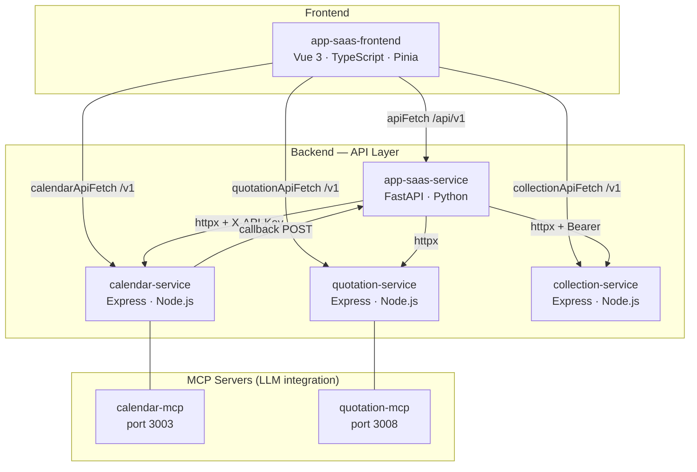

---

## Responsabilidad de cada repositorio

### `app-saas-frontend`
Interfaz web principal del CRM. Es el único cliente que agrupa y presenta toda la funcionalidad del sistema. Consume los cuatro backends directamente mediante cuatro funciones fetch independientes (`apiFetch`, `calendarApiFetch`, `quotationApiFetch`, `collectionApiFetch`), cada una con su propio base URL configurado por variable de entorno.

Dominios funcionales cubiertos: leads, contactos, proyectos, propiedades, conversaciones, analytics, cobranza, cotizaciones, expedientes/postventa, calendarios, campañas de marketing, agentes de IA, configuraciones.

### `app-saas-service`
El núcleo del sistema y orquestador interno. Contiene el modelo de datos completo (leads, contactos, proyectos, propiedades, usuarios, roles, tenants) y todas las integraciones externas. Adicionalmente:

- **Agentes de IA** (LangGraph): supervisor con tool-calling que coordina intake, calificación BANT, reenganche, negociación, comunicación y gestión de expedientes.
- **Workers asincrónicos** (Celery + Redis): tareas en background.
- **Flujos durables** (Temporal): orquesta workflows de larga duración — seguimiento post-visita, reenganche, SLA de expedientes, resúmenes diarios, recordatorios, campañas, análisis de sentimiento, WhatsApp window management, supervisor de asesores.
- **RAG** (Pinecone): recuperación semántica sobre proyectos y propiedades.
- **OCR dual-rail** (Mistral + Claude Haiku): validación de documentos de expedientes.

### `calendar-service`
Gestión de calendarios, eventos con soporte de recurrencia, asistentes y agendas de asesores. Multitenancy nativo. Incluye un **MCP Server** que expone herramientas de calendarios y eventos directamente a LLMs. Envía callbacks a `app-saas-service` cuando se confirma o reagenda una visita.

### `quotation-service`
Generación de PDFs de cotizaciones inmobiliarias con cálculos de financiamiento FHA (enganche mínimo 5%, ingreso mínimo ×2) y banco convencional (enganche mínimo 20%, ingreso mínimo ×2.5). Los PDFs se almacenan en Azure Blob Storage. También incluye un **MCP Server** para integración con LLMs.

### `collection-service`
Microservicio financiero/cobranza. El más extenso de los tres (23 módulos). Maneja el ciclo de vida completo de un crédito inmobiliario: préstamos, tabla de cuotas, pagos manuales, reconciliación bancaria, reservas de pago, documentos con OCR, plantillas de formularios dinámicos, ficha configurable del cliente y shortcuts de URL para portal del cliente.

---

## Dependencias entre repositorios

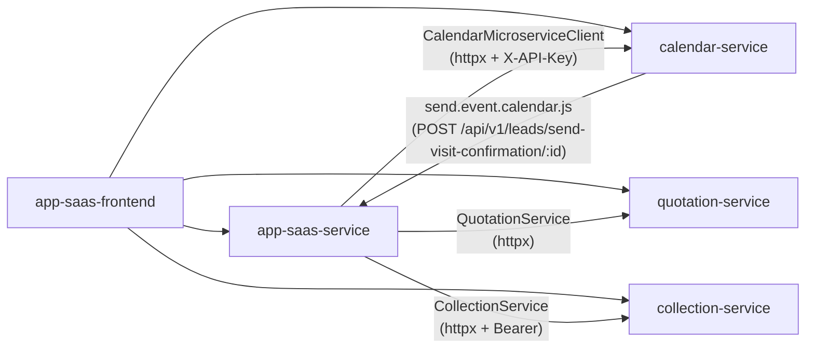

### Tabla de dependencias directas

| Quién llama | A quién llama | Mecanismo | Cuándo |
|---|---|---|---|
| `app-saas-frontend` | `app-saas-service` | `apiFetch` + Auth0 JWT + X-Tenant-ID | Toda la operación core del CRM |
| `app-saas-frontend` | `calendar-service` | `calendarApiFetch` + Auth0 JWT | Vistas de calendario |
| `app-saas-frontend` | `quotation-service` | `quotationApiFetch` + Auth0 JWT | Generación/listado de cotizaciones |
| `app-saas-frontend` | `collection-service` | `collectionApiFetch` + Auth0 JWT | Préstamos, pagos, cobranza |
| `app-saas-service` | `calendar-service` | httpx + `X-API-Key` + `X-Tenant-ID` | Agentes IA agendan/consultan visitas |
| `app-saas-service` | `quotation-service` | httpx | Generación automática de cotizaciones |
| `app-saas-service` | `collection-service` | httpx + Bearer token | Crear/consultar reservas |
| `calendar-service` | `app-saas-service` | axios + `X-API-Key` (`QUOTATION_API_KEY`) | Callback al confirmar visita |

**Servicios independientes**: `quotation-service` y `collection-service` no dependen de ningún otro microservicio PropFlow.

---

## Flujo de autenticación

Todos los servicios usan **Auth0** como proveedor de identidad. El patrón es idéntico en todos: JWT Bearer + `X-Tenant-ID`.

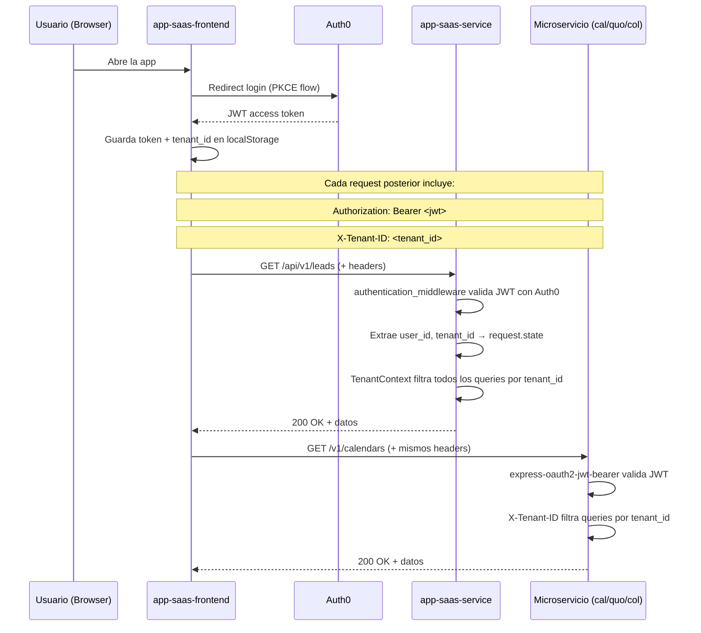

### Rutas públicas (sin autenticación en app-saas-service)
- `/health`, `/docs`, `/openapi.json`
- `/api/v1/webhooks/*` — webhooks de plataformas externas
- `/api/v1/public/*` — master plan, mapa de propiedades
- `/api/v1/leads/send-visit-confirmation/*` — callback desde `calendar-service` (usa `X-API-Key`)
- `/api/v1/integrations/facebook/callback`, `/api/v1/integrations/slack/callback`

### Comunicación servidor-a-servidor
Los microservicios no usan JWT para llamarse entre sí. Usan **API Key** en header `X-API-Key`. Configurado via `CALENDAR_SERVICE_API_KEY` (en app-saas-service) y `QUOTATION_API_KEY` (reutilizado como API key genérica interna entre servicios).

---

## Flujo de datos

### Flujo estándar: consultar leads

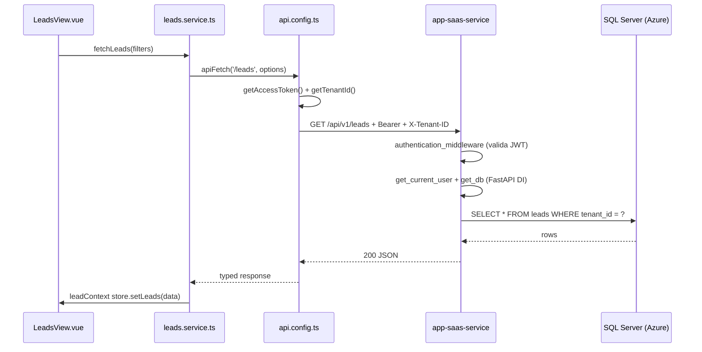

### Flujo con agente IA: agendar visita

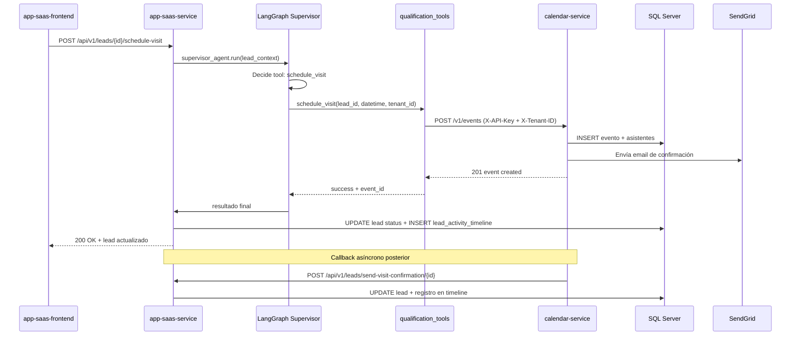

### Flujo de cobranza: crear préstamo desde expediente

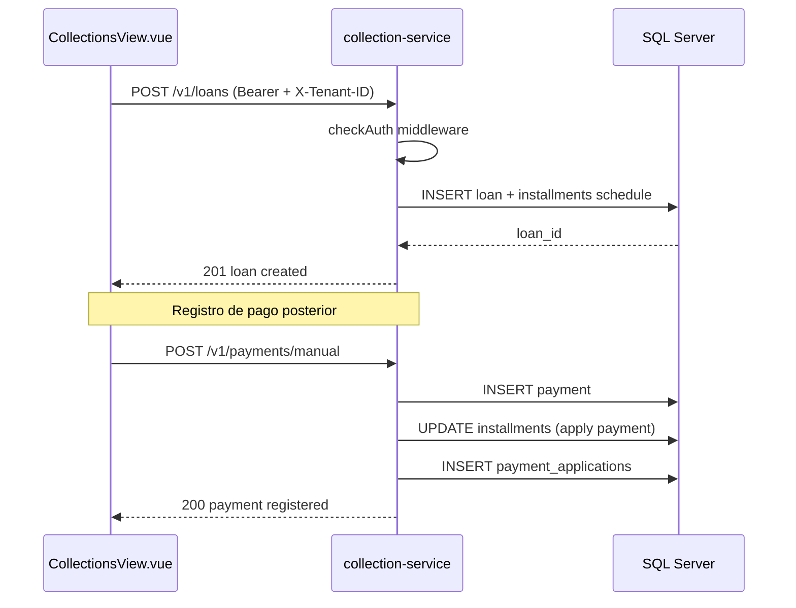

### Flujo de Temporal (workflows durables)

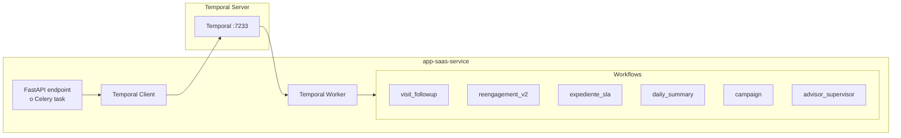

Los workflows de Temporal gestionan todo proceso de larga duración: seguimiento post-visita, reenganche progresivo, SLA de expedientes, resúmenes diarios de asesores, campañas masivas WhatsApp, supervisión de performance de asesores, y gestión de ventanas de conversación WhatsApp.

---

## Sistema de agentes IA (LangGraph)

El `supervisor_agent.py` implementa el patrón **Supervisor con Tool-Calling** usando LangGraph. El agente mantiene estado (`SupervisorState`) y decide qué tool ejecutar en cada interacción con un lead.

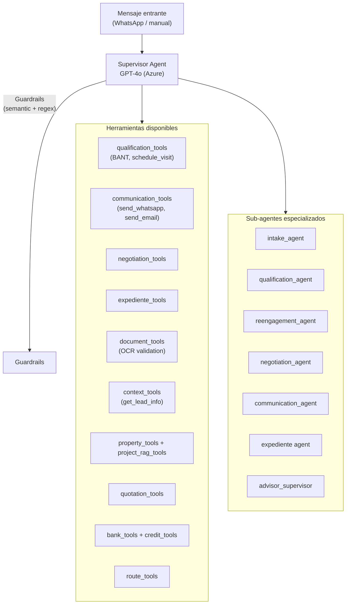

El supervisor usa **Azure OpenAI GPT-4o** para decisiones de orquestación. Los guardrails (filtrado de contenido fuera de scope) usan **GPT-4o-mini**. El supervisor de asesores usa **Claude Haiku 4.5 y Claude Sonnet 4.6** servidos desde Azure AI Foundry.

---

## Integraciones externas

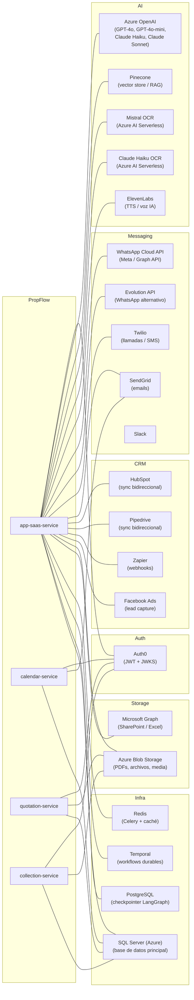

### Tabla de integraciones

| Integración | Servicio que la usa | Propósito |
|---|---|---|
| **Auth0** | Todos | Autenticación JWT (PKCE en frontend, Bearer en backends) |
| **Azure OpenAI** | `app-saas-service` | GPT-4o (supervisor agente), GPT-4o-mini (guardrails) |
| **Azure AI Foundry** | `app-saas-service` | Claude Haiku 4.5 y Sonnet 4.6 (supervisor asesores), Mistral OCR y Claude Haiku (OCR dual-rail) |
| **Pinecone** | `app-saas-service` | Vector store para RAG de proyectos y propiedades |
| **ElevenLabs** | `app-saas-service` | Text-to-speech para voz de IA |
| **WhatsApp Cloud API** | `app-saas-service` | Canal principal de comunicación con leads (Meta/Graph) |
| **Evolution API** | `app-saas-service` | Canal WhatsApp alternativo |
| **Twilio** | `app-saas-service` | Llamadas y SMS |
| **SendGrid** | `app-saas-service`, `calendar-service` | Emails transaccionales y notificaciones |
| **Slack** | `app-saas-service` | Notificaciones internas a equipos |
| **HubSpot** | `app-saas-service` | Sincronización bidireccional de leads (pipeline mapping) |
| **Pipedrive** | `app-saas-service` | Sincronización bidireccional de leads (pipeline mapping) |
| **Facebook Ads** | `app-saas-service` | Captura de leads, ad performance insights |
| **Zapier** | `app-saas-service` | Webhooks de entrada/salida para automatizaciones externas |
| **Azure Blob Storage** | `app-saas-service`, `quotation-service`, `collection-service` | Almacenamiento de PDFs, documentos, media |
| **Microsoft Graph** | `app-saas-service` | Acceso a SharePoint / Excel (sales tracking de asesores) |
| **Redis** | `app-saas-service` | Celery workers + caché de contexto de usuario |
| **Temporal** | `app-saas-service` | Workflows durables (reenganche, SLA, campañas, etc.) |
| **PostgreSQL** | `app-saas-service` | Solo checkpointer de LangGraph (no datos de negocio) |
| **SQL Server (Azure)** | Todos los backends | Base de datos principal compartida |
| **Traefik** | Producción | Reverse proxy + TLS para todos los servicios |

---

## Infraestructura compartida

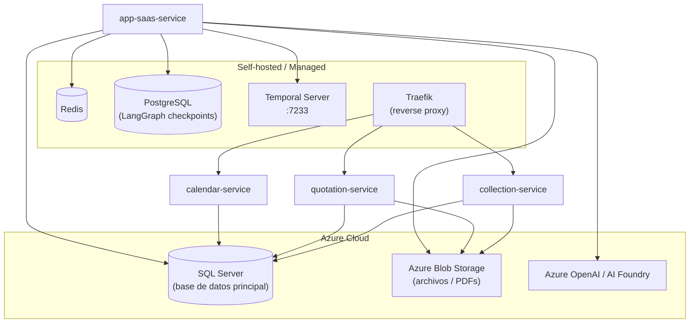

**Nota sobre base de datos**: Todos los microservicios conectan al mismo SQL Server de Azure. No se confirmó si comparten la misma base de datos o usan bases separadas dentro del mismo servidor.

---

## MCP Servers

`calendar-service` y `quotation-service` exponen servidores MCP que permiten a LLMs (Claude u otros) interactuar directamente con sus capacidades sin pasar por la API REST.

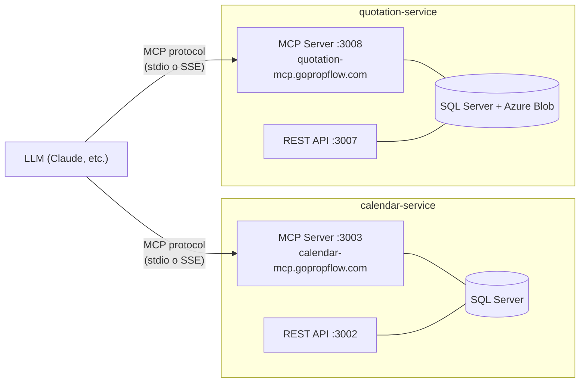

Ambos MCP servers se autentican via `MCP_API_KEY` o `API_KEY` (variable de entorno) y acceden directamente a la base de datos, no a través de la REST API.

---

## Estructura interna de módulos (patrón Node.js)

Los tres microservicios Node.js comparten la misma arquitectura interna:

```
src/modules/<entidad>/
  commands/        # Escritura: create, update, delete (un archivo por operación)
  queries/         # Lectura: getById, list, filter
  controllers/     # Express request handlers (llaman commands/queries)
  entities/        # Modelos Sequelize (mapeo a SQL Server)
  services/        # Lógica de negocio adicional (cuando aplica)

src/infrastructure/
  adapters/        # Clientes de servicios externos
  common/          # DB connection, utilidades compartidas
  presentation/
    routes/        # Definición de rutas Express
    middlewares/   # Auth (checkJwt), CORS, error handler
```

### Módulos por microservicio

**calendar-service**: `advisor`, `advisor_schedules`, `calendars`, `events`, `lead_activity_timeline`, `leads`, `project_milestones`, `projects`, `tasks`, `tenants`

**quotation-service**: `quotation_tool`, `version`

**collection-service**: `bank`, `charges`, `contacts`, `customer_card_config`, `customer_card_values`, `documents`, `files`, `form_template_fields`, `form_templates`, `generated_documents`, `installments`, `leads`, `loans`, `ocr_field_config`, `payment_applications`, `payment_reservations`, `payment_transactions`, `projects`, `properties`, `public_customer_card`, `reservations`, `url_shortcuts`

---

## Workflows Temporal activos

Los siguientes workflows están implementados en `app/temporal/` y son gestionados por el `temporal-worker`:

| Workflow | Propósito |
|---|---|
| `visit_followup` | Seguimiento automático post-visita |
| `visit_overdue` | Notificación de visitas vencidas |
| `reengagement_v2` / `insistence_reengagement` | Reenganche progresivo de leads inactivos |
| `intake_reengagement` | Reenganche durante el proceso de intake |
| `expediente_sla` | Control de SLAs de expedientes de postventa |
| `campaign` | Envío masivo de campañas WhatsApp |
| `daily_summary` | Resumen diario de actividad de asesores |
| `sentiment` | Análisis de sentimiento de conversaciones |
| `task_reminders` | Recordatorios de tareas programadas |
| `postventa_reminders` / `postventa_maintenance` | Recordatorios y mantenimiento de expedientes |
| `advisor_supervisor` | Evaluación periódica de performance de asesores |
| `advisor_whatsapp` | Gestión de conversaciones WhatsApp de asesores |
| `whatsapp_window` / `whatsapp_window_alert` | Control de ventana de 24h de WhatsApp |
| `facebook_insights` | Sync de métricas de Facebook Ads |

---

## Aspectos no confirmados en el código

Los siguientes puntos son inferencias arquitectónicas que **no fueron verificados** leyendo código fuente específico:

- **Esquema SQL compartido vs separado**: No está confirmado si `calendar-service`, `quotation-service` y `collection-service` usan la misma base de datos SQL Server que `app-saas-service` o bases de datos independientes en el mismo servidor.
- **Si `collection-service` tiene MCP Server**: No tiene scripts `mcp` en su `package.json` ni `@modelcontextprotocol/sdk` como dependencia. Presumiblemente no lo tiene, pero no fue verificado.
- **Activación del agente desde endpoints específicos**: El flujo del agente LangGraph fue trazado a nivel de componentes, pero no se verificó la ruta exacta del endpoint que dispara el supervisor.
- **Uso de Airflow**: Existe `Dockerfile.airflow` y carpeta `pipeline/` en `app-saas-service`, pero no se leyó el contenido. No está claro si Airflow está activo en producción.
