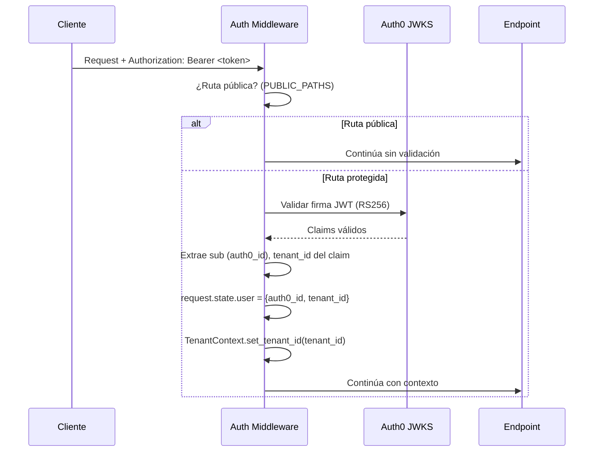

# PropFlow Backend — Guía de desarrollo

Referencia técnica del repositorio `app-saas-service`. Basada en análisis directo del código fuente.

---

## Índice

1. [Stack y configuración](#1-stack-y-configuración)
2. [Arquitectura FastAPI](#2-arquitectura-fastapi)
3. [Autenticación y middleware](#3-autenticación-y-middleware)
4. [Dependencias (Dependency Injection)](#4-dependencias-dependency-injection)
5. [Endpoints por dominio](#5-endpoints-por-dominio)
6. [Servicios](#6-servicios)
7. [Modelos de base de datos](#7-modelos-de-base-de-datos)
8. [Repositorios](#8-repositorios)
9. [Schemas (Pydantic)](#9-schemas-pydantic)
10. [Sistema de agentes IA](#10-sistema-de-agentes-ia)
11. [Temporal workflows](#11-temporal-workflows)
12. [Background tasks](#12-background-tasks)
13. [Base de datos](#13-base-de-datos)
14. [Convenciones](#14-convenciones)

---

## 1. Stack y configuración

| Tecnología | Uso |
|---|---|
| **FastAPI** | Framework REST API (async) |
| **Uvicorn** | ASGI server |
| **SQLAlchemy 2.0 async** | ORM (SQL Server) |
| **aioodbc / pyodbc** | Driver MSSQL para SQLAlchemy async |
| **Alembic** | Migraciones de base de datos |
| **Pydantic v2** | Validación de schemas (settings + request/response) |
| **pydantic-settings** | Configuración desde `.env` |
| **LangGraph / LangChain** | Agentes de IA (supervisor pattern) |
| **Temporalio** | Workflows duraderos y orquestación async |
| **Celery + Redis** | Tareas en background (legacy, convive con Temporal) |
| **Azure OpenAI** | GPT-4o, GPT-4o-mini, Claude Haiku/Sonnet via Azure AI Foundry |
| **Pinecone** | Vector store para RAG (propiedades, proyectos) |
| **Azure Blob Storage** | Almacenamiento de archivos (documentos, imágenes, PDFs) |
| **Auth0** | Autenticación JWT (RS256) |
| **Redis** | Caché de contexto de usuario, Celery broker |
| **PostgreSQL** | Solo para LangGraph checkpointer (estado de agentes) |
| **SQL Server (Azure)** | Base de datos principal |
| **httpx** | Cliente HTTP async para llamadas a microservicios |
| **SendGrid** | Envío de emails |

### Variables de entorno clave

Toda la configuración se carga desde `.env` vía `config/settings.py` usando `pydantic-settings`.

```
# Base de datos
DATABASE_URL                    # mssql+pyodbc://...
DATABASE_POOL_SIZE              # 150 (S6, 400 DTUs)
DATABASE_MAX_OVERFLOW           # 75

# PostgreSQL (solo checkpointer LangGraph)
POSTGRES_CHECKPOINT_HOST        # ...
POSTGRES_CHECKPOINT_DATABASE    # ...
POSTGRES_CHECKPOINT_USER        # user@server (Azure format)
POSTGRES_CHECKPOINT_PASSWORD    # ...

# Azure OpenAI
AZURE_OPENAI_ENDPOINT           # https://...
AZURE_OPENAI_API_KEY            # ...
AZURE_OPENAI_DEPLOYMENT_NAME    # gpt-4o (default para agentes)
AZURE_OPENAI_GPT4O_DEPLOYMENT   # gpt-4o
AZURE_OPENAI_GPT4O_MINI_DEPLOYMENT  # gpt-4o-mini (guardrails, intent)
AZURE_OPENAI_HAIKU_4_5          # claude-haiku-4-5 (advisor supervisor)
AZURE_OPENAI_SONNET_4_6         # claude-sonnet-4-6

# Auth0
AUTH0_DOMAIN                    # propflow.us.auth0.com
AUTH0_AUDIENCE                  # https://api.gopropflow.com
AUTH0_CLIENT_ID                 # ...
AUTH0_CLIENT_SECRET             # ...

# Microservicios
CALENDAR_SERVICE_URL            # http://localhost:3002
CALENDAR_SERVICE_API_KEY        # ...
QUOTATION_SERVICE_HOST          # localhost
QUOTATION_SERVICE_PORT          # 3007
QUOTATION_API_KEY               # ...
COLLECTION_SERVICE_URL          # http://localhost:3010
COLLECTION_API_KEY              # ...

# Integraciones externas
WHATSAPP_API_KEY                # Meta Graph API
SENDGRID_API_KEY                # ...
ELEVENLABS_API_KEY              # voz
PINECONE_API_KEY                # vector store
AZURE_STORAGE_CONNECTION_STRING # blob storage
REDIS_URL                       # redis://localhost:6379/0
WEBHOOK_SECRET                  # validación de webhooks entrantes

# n8n
N8N_LEAD_STATUS_WEBHOOK_URL     # opcional — notifica cambios de status
```

---

## 2. Arquitectura FastAPI

### Estructura del proyecto

```
app-saas-service/
├── app/
│   ├── main.py              # Punto de entrada — FastAPI app, middlewares, lifespan
│   ├── api/
│   │   ├── v1/              # ~70 archivos de endpoints (uno por entidad)
│   │   │   └── __init__.py  # api_router — agrega todos los sub-routers
│   │   └── dependencies.py  # Dependency injection (get_db, get_current_user, etc.)
│   ├── agents/              # LangGraph agents (supervisor, intake, qualification…)
│   ├── core/                # Excepciones, contextos, constantes, utilidades
│   ├── db/
│   │   ├── models.py        # Modelos SQLAlchemy (~100 clases)
│   │   ├── models_auth.py   # User, Role, Permission, AuditLog
│   │   ├── models_notifications.py
│   │   ├── models_fha.py
│   │   ├── models_postventa.py
│   │   ├── models_credit.py
│   │   ├── models_email.py
│   │   ├── models_advisor_performance.py
│   │   ├── models_advisor_whatsapp.py
│   │   ├── models_postponement.py
│   │   ├── session.py       # Engine, async_session_maker, get_db()
│   │   ├── postgres_checkpoint.py  # LangGraph checkpointer (PostgreSQL)
│   │   └── repositories/    # ~60 repositorios
│   ├── middleware/
│   │   └── authentication.py  # Auth0 JWT validation
│   ├── monitoring/
│   │   └── agent_monitor.py   # Monitoreo de agentes IA
│   ├── prompts/             # System prompts de los agentes (archivos de texto)
│   ├── schemas/             # Pydantic schemas (~50 archivos)
│   ├── services/            # Lógica de negocio (~80 servicios)
│   ├── tasks/               # Background tasks (OCR, snooze reactivator)
│   ├── temporal/            # Temporal workflows y activities
│   └── utils/               # Helpers (formateo, fechas, etc.)
├── config/
│   ├── settings.py          # Configuración centralizada (pydantic-settings)
│   └── logging.py           # Loguru + JSON logs
├── alembic/
│   └── versions/            # ~120 migraciones
├── airflow/dags/            # DAGs de Airflow (retención de datos)
└── contracts/               # JSON con contratos de API por entidad
```

### Inicialización de la app (lifespan)

```python
# main.py
@asynccontextmanager
async def lifespan(app: FastAPI):
    # On startup:
    snooze_task = asyncio.create_task(run_snooze_reactivator())
    status_queue_task = asyncio.create_task(webhook_status_queue.start_worker())
    yield
    # On shutdown: drain queue + cancel tasks
    await webhook_status_queue.shutdown()
```

Al iniciar la app se lanzan dos tareas asyncio:
- `run_snooze_reactivator` — reactiva notificaciones snoozed cada 60 segundos
- `webhook_status_queue.start_worker()` — procesa cola interna de actualizaciones de estado de webhooks

### Router principal

`app/api/v1/__init__.py` define `api_router` que incluye todos los sub-routers. El prefijo base es `/api/v1` (configurable vía `settings.api_v1_prefix`).

Algunos routers se montan directamente en `main.py` fuera del `api_router` (para evitar duplicación en OpenAPI):
- `project_context`, `property_models`, `properties`, `call_callbacks`, `lead_control`, `audit_log`, entre otros.

---

## 3. Autenticación y middleware

### Middlewares registrados

```python
# main.py — orden de ejecución (LIFO en FastAPI)
app.add_middleware(CORSMiddleware, ...)   # 1. CORS
app.middleware("http")(log_requests)      # 2. Request/response logging
app.middleware("http")(auth_middleware)   # 3. Auth0 JWT validation (innermost)
```

### Flujo de autenticación



### Rutas públicas (sin auth)

```python
PUBLIC_PATHS = (
    "/health",
    "/docs", "/openapi.json", "/redoc",
    "/api/v1/webhooks/*",       # webhooks externos (Meta, Zapier)
    "/api/v1/elevenlabs/*",     # ElevenLabs webhooks
    "/api/v1/callbacks/*",      # Callbacks de servicios externos
    "/api/v1/public/*",         # Portal público (mapa, landing)
    "/api/v1/leads/send-quotation/*",
    "/api/v1/leads/send-visit-confirmation/*",
    "/api/v1/leads/public",
    "/api/v1/leads/public/tour-scheduled",
    "/api/v1/leads/tour-rescheduled",  # S2S desde calendar-service
    "/api/v1/leads/public/marketplace",
    "/api/v1/leads/public/prequalified",
    "/api/v1/projects/amenities/*",
    "/api/v1/integrations/slack/callback",
    "/api/v1/integrations/facebook/callback",
)
```

### Exception handlers globales

| Excepción | Status | Cuerpo |
|---|---|---|
| `PropFlowException` | `exc.status_code` | `{code, message}` |
| `Exception` (catch-all) | 500 | `{code: "INTERNAL_ERROR", message}` |

---

## 4. Dependencias (Dependency Injection)

Las dependencias se definen en `app/api/dependencies.py` y se inyectan en los endpoints vía `Depends()`.

### Dependencias principales

```python
# Sesión de base de datos (SQL Server)
async def get_db() -> AsyncSession

# Tenant ID desde el JWT
async def get_current_tenant(request: Request) -> str

# UserContext completo (user_id, tenant_id, roles, permissions)
# Con caché en 3 niveles: intra-request → Redis (TTL 300s) → DB
async def _load_user_context(request: Request, db: AsyncSession) -> UserContext

# Usuario actual (entidad User de DB)
async def get_current_user(request: Request, db: AsyncSession) -> User

# Repositorio de leads precargado con tenant_id
async def get_lead_repo(db, tenant_id) -> LeadRepository

# Repositorio de contactos
async def get_contact_repo(db, tenant_id) -> ContactRepository

# Validar API Key (S2S)
async def verify_api_key(x_api_key: Header) -> bool

# Factory: verifica permiso RBAC específico
def require_permission(permission: str) -> Dependency
    # → HTTPException 403 si el usuario no tiene el permiso

# Solo system admins (is_system_admin = True)
async def require_system_admin(request, db) -> UserContext
```

### Ejemplo de uso en un endpoint

```python
@router.get("/{lead_id}", response_model=LeadDetailResponse)
async def get_lead(
    lead_id: int,
    db: AsyncSession = Depends(get_db),
    tenant_id: str = Depends(get_current_tenant),
    user_ctx: UserContext = Depends(require_permission("leads.view")),
):
    repo = LeadRepository(db, tenant_id)
    lead = await repo.get_by_id(lead_id)
    ...
```

### Autenticación S2S (service-to-service)

Los endpoints de callback que llaman otros microservicios usan `X-API-Key`:

```python
async def verify_api_key(x_api_key: str = Header(..., alias="X-API-Key")) -> bool:
    if x_api_key != settings.QUOTATION_API_KEY:
        raise HTTPException(401, "Invalid API Key")
```

Webhook por proyecto usan SHA-256 hash del API key:

```python
async def verify_project_webhook_api_key(x_api_key: str = Header(...)) -> tuple:
    # → retorna (tenant_id, project_id, config_id, scopes)
```

---

## 5. Endpoints por dominio

Todos bajo el prefijo `/api/v1`. Documentación interactiva disponible en `/docs` y `/redoc` en modo `development`.

### Auth (`/api/v1/auth/`)

| Método | Ruta | Descripción |
|---|---|---|
| POST | `/owner` | Asocia usuario Auth0 con tenant (registro/login inicial) |
| GET | `/me` | Usuario actual con roles y permisos |
| GET | `/profile` | Perfil del usuario |
| PUT | `/profile` | Actualizar perfil |
| POST | `/invite` | Invitar usuario al tenant |
| POST | `/password-reset` | Reset de contraseña |
| GET | `/permissions` | Permisos del usuario (para frontend RBAC) |
| POST | `/set-password` | Establecer nueva contraseña |

### Leads (`/api/v1/leads/`)

El endpoint más extenso del sistema (~5700 líneas de código).

| Método | Ruta | Descripción |
|---|---|---|
| POST | `/webhook` | Crear lead desde webhook externo |
| POST | `/webhook/status` | Actualizar status desde webhook |
| POST | `/` | Crear lead manual |
| POST | `/public` | Crear lead sin auth (landing público) |
| GET | `/v2` | Listar leads paginados con filtros avanzados |
| GET | `/v2/ids` | IDs de leads filtrados (bulk operations) |
| GET | `/v2/filter-options` | Opciones de filtros disponibles |
| GET | `/export` | Exportar leads a CSV/XLSX |
| GET | `/stats` | Estadísticas del pipeline |
| GET | `/search` | Búsqueda full-text |
| GET | `/{lead_id}` | Detalle del lead |
| PATCH | `/{lead_id}` | Actualizar lead |
| PATCH | `/{lead_id}/assign` | Asignar asesor |
| DELETE | `/{lead_id}` | Eliminar lead |
| POST | `/{lead_id}/trigger-post-visit` | Dispara flujo post-visita |
| POST | `/{lead_id}/confirm-documents` | Confirmar documentos |
| POST | `/{lead_id}/start-nurturing` | Iniciar nurturing |
| GET | `/{lead_id}/nurturing-status` | Estado del nurturing |
| GET | `/{lead_id}/timeline` | Timeline de actividad |
| GET | `/{lead_id}/insights` | Análisis de IA |
| GET | `/{lead_id}/campaigns` | Campañas asociadas |
| PATCH | `/{lead_id}/star-rating` | Calificación con estrellas |
| POST | `/{lead_id}/analyze-sentiment` | Análisis de sentimiento (IA) |
| PATCH | `/{lead_id}/mark-read` | Marcar como leído |
| POST | `/{lead_id}/send-message` | Enviar mensaje WhatsApp |
| POST | `/{lead_id}/send-media` | Enviar media WhatsApp |
| POST | `/send-first-contact-template/bulk` | Envío masivo de template de primer contacto |
| POST | `/{lead_id}/send-first-contact-template` | Enviar template de primer contacto |
| POST | `/{lead_id}/send-reengagement-template` | Enviar template de reenganche |
| POST | `/send-quotation/{lead_id}` | Generar y enviar cotización (llama quotation-service) |
| POST | `/{lead_id}/change-status` | Cambio de status |
| POST | `/send-visit-confirmation/{lead_id}` | Confirmar visita (callback de calendar-service) |
| POST | `/{lead_id}/upload-media` | Subir media |
| PATCH | `/{lead_id}/deactivate` | Desactivar |
| PATCH | `/{lead_id}/activate` | Activar |
| POST | `/bulk-activate` | Activación masiva |
| POST | `/bulk-deactivate` | Desactivación masiva |
| POST | `/bulk-status-change` | Cambio masivo de status |
| POST | `/bulk-assign-advisor` | Asignación masiva de asesor |

### Proyectos (`/api/v1/projects/`)

| Método | Ruta | Descripción |
|---|---|---|
| POST | `/` | Crear proyecto |
| GET | `/` | Listar proyectos |
| GET | `/{project_id}` | Detalle del proyecto |
| PUT | `/{project_id}` | Actualizar proyecto |
| DELETE | `/{project_id}` | Eliminar proyecto |
| POST | `/{project_id}/context` | Actualizar contexto del proyecto |
| GET | `/{project_id}/context` | Obtener contexto |
| POST | `/{project_id}/documents` | Subir documento al proyecto |
| GET | `/{project_id}/documents` | Listar documentos |
| DELETE | `/{project_id}/documents/{doc_id}` | Eliminar documento |
| POST | `/{project_id}/knowledge` | Agregar texto de conocimiento |
| POST | `/{project_id}/milestones` | Crear hito del proyecto |
| GET | `/{project_id}/milestones` | Listar hitos |
| GET | `/amenities/{project_id}` | Amenities del proyecto (público) |

### Propiedades y modelos

| Ruta base | Descripción |
|---|---|
| `/api/v1/properties/` | CRUD de propiedades + disponibilidad + filtros |
| `/api/v1/property-models/` | CRUD de modelos de propiedad |
| `/api/v1/property-models/{id}/images` | Imágenes del modelo |
| `/api/v1/property-models/{id}/floor-plans` | Planos del modelo |
| `/api/v1/property-models/{id}/tech-documents` | Documentos técnicos |
| `/api/v1/property-models/{id}/videos` | Videos del modelo |
| `/api/v1/property-models/{id}/text-contents` | Contenido textual |
| `/api/v1/projects/{id}/videos` | Videos del proyecto |
| `/api/v1/projects/{id}/master-plan` | Plano maestro (marketplace) |

### Conversaciones y comunicación

| Ruta base | Descripción |
|---|---|
| `/api/v1/conversations/search` | Búsqueda de conversaciones |
| `/api/v1/conversations/{lead_id}` | Historial de conversaciones por lead |
| `/api/v1/conversations/{lead_id}/grouped` | Conversaciones agrupadas |
| `/api/v1/conversations/audio/{conv_id}` | Archivo de audio |
| `/api/v1/calls/` | Gestión de llamadas |
| `/api/v1/emails/` | Gestión de emails (inbox, envío) |
| `/api/v1/advisor-chat/` | Chat asesor-to-asesor |
| `/api/v1/advisor-whatsapp/` | Módulo WhatsApp del asesor |
| `/api/v1/voice-messages/` | Mensajes de voz |

### Usuarios y RBAC

| Ruta base | Descripción |
|---|---|
| `/api/v1/users/` | CRUD de usuarios, asignar roles, activar/desactivar |
| `/api/v1/roles/` | CRUD de roles del tenant |
| `/api/v1/modules/` | Módulos del sistema (catálogo de permisos) |
| `/api/v1/invitations/` | Invitaciones pendientes |

### Postventa y expedientes

| Ruta base | Descripción |
|---|---|
| `/api/v1/postventa/` | Expedientes de postventa |
| `/api/v1/postventa/config` | Configuración de postventa |
| `/api/v1/postventa/credito` | Crédito dentro de postventa |
| `/api/v1/postventa/observaciones` | Observaciones del expediente |
| `/api/v1/postventa/handoff` | Handoff de expediente entre etapas |
| `/api/v1/fha/` | Expedientes FHA (Mi Primera Casa) |
| `/api/v1/files/` | Gestión de expedientes (files) |

### Otros módulos

| Ruta base | Descripción |
|---|---|
| `/api/v1/tasks/` | Tareas (CRM tasks) |
| `/api/v1/advisors/` | Asesores, schedules, asignaciones a proyectos |
| `/api/v1/advisor-performance/` | Supervisor nocturno de asesores (IA) |
| `/api/v1/advisor-locations/` | Ubicación en tiempo real de asesores |
| `/api/v1/advisor-call-logs/` | Logs de llamadas del asesor |
| `/api/v1/contacts/` | Contactos (entidad independiente de leads) |
| `/api/v1/analytics/` | Analytics de leads y campañas |
| `/api/v1/marketing-dashboard/` | Dashboard de marketing |
| `/api/v1/campaigns/` | Campañas de distribución |
| `/api/v1/distribution-lists/` | Listas de distribución |
| `/api/v1/notifications/` | Notificaciones del usuario |
| `/api/v1/sse/` | SSE stream para tiempo real |
| `/api/v1/tenants/` | Configuración del tenant |
| `/api/v1/agents/` | Configuración de agentes IA |
| `/api/v1/agent-documents/` | Documentos de entrenamiento del agente |
| `/api/v1/workflows/` | Workflows de negocio (business rules) |
| `/api/v1/business-rules/` | Reglas de negocio |
| `/api/v1/nurturing-templates/` | Templates de nurturing |
| `/api/v1/integration-configs/` | Configuraciones de integraciones externas |
| `/api/v1/whatsapp-config/` | Configuración WhatsApp del tenant |
| `/api/v1/meta-messaging-config/` | Config Meta Messaging (Messenger/Instagram) |
| `/api/v1/downloads/` | Gestión de descargas/exportaciones |
| `/api/v1/audit-log/` | Log de auditoría |
| `/api/v1/payments/` | Pagos (proxy a collection-service) |
| `/api/v1/temporal/` | API de gestión de workflows Temporal |
| `/api/v1/webhooks/` | Webhooks entrantes (Meta/WhatsApp, etc.) |
| `/api/v1/zapier-webhook/` | Integraciones Zapier |
| `/api/v1/hitl/` | Human-in-the-loop (revisión manual de agentes) |

---

## 6. Servicios

Los servicios encapsulan la lógica de negocio. Se ubican en `app/services/`. La mayoría son singletons (patrón `__new__`).

### Servicios core

| Servicio | Descripción |
|---|---|
| `lead_service.py` | Cambios de status, validaciones, notificaciones SSE, webhook n8n, sync Pipedrive |
| `advisor_assignment_service.py` | Round-robin / lógica de asignación de asesores |
| `auth_service.py` | Validación de tokens Auth0 (JWKS cache) |
| `rbac_service.py` | Inicialización y seed de roles y permisos |
| `timeline_service.py` | Registro de eventos en `lead_activity_timeline` |
| `notification_service.py` | Crear y enviar notificaciones (SSE + WhatsApp + Email) |
| `sse_service.py` | Gestión de conexiones SSE por tenant |

### Clientes de microservicios

| Servicio | Llama a | Método |
|---|---|---|
| `calendar_microservice.py` | `calendar-service` | HTTP + `X-API-Key` |
| `quotation_service.py` | `quotation-service` | HTTP + `QUOTATION_API_KEY` |
| `collection_service.py` | `collection-service` | HTTP + `COLLECTION_API_KEY` |

### Servicios de comunicación

| Servicio | Descripción |
|---|---|
| `whatsapp_cloud_api_service.py` | Envío de mensajes via Meta Cloud API |
| `whatsapp_router.py` | Decide canal WhatsApp (Cloud API vs Evolution/WABA propio) |
| `evolution_api_service.py` | WhatsApp via Evolution API (instancias propias del asesor) |
| `email_service.py` | Envío y recepción de emails (SendGrid + inbound parse) |
| `call_service.py` | Gestión de llamadas (ElevenLabs + Twilio) |
| `text_to_speech_service.py` | ElevenLabs TTS |
| `speech_to_text_service.py` | Transcripción de audio |
| `audio_conversion_service.py` | Conversión WebM → OGG (para WhatsApp) |

### Servicios de IA y agentes

| Servicio | Descripción |
|---|---|
| `llm_service.py` | Wrapper sobre Azure OpenAI (GPT-4o, GPT-4o-mini) |
| `vector_service.py` | Pinecone — indexar y buscar propiedades/proyectos |
| `project_rag_service.py` | RAG sobre documentos de proyecto |
| `property_rag_service.py` | RAG sobre propiedades |
| `property_model_rag_service.py` | RAG sobre modelos de propiedad |
| `sentiment_analysis_service.py` | Análisis de sentimiento de conversaciones |
| `evaluation_service.py` | Evaluación de agentes (métricas LLM) |
| `intent_detection_service.py` | Clasificación de intención del lead |
| `transcript_analysis_service.py` | Análisis de transcripciones de llamadas |

### Servicios de storage

| Servicio | Descripción |
|---|---|
| `azure_storage_service.py` | CRUD sobre Azure Blob Storage, generación de SAS tokens |
| `document_validation_service.py` | Orquesta OCR dual-rail (Mistral → Haiku) |
| `file_service.py` | Gestión de expedientes (files) |
| `upload_token_service.py` | Tokens para upload sin auth |

### Integraciones externas

| Servicio | Descripción |
|---|---|
| `hubspot_service.py` | Sync leads con HubSpot CRM |
| `hubspot_mapping_service.py` | Mapeo de campos PropFlow ↔ HubSpot |
| `pipedrive_sync_service.py` | Sync leads con Pipedrive |
| `facebook_ads_service.py` | Meta Marketing API (ad insights, lead forms) |
| `facebook_feedback_service.py` | Feedback de leads a Facebook Ads |
| `zapier_webhook_service.py` | Enviar eventos a Zapier |
| `slack_service.py` / `slack_config.py` | Notificaciones Slack |
| `maps_directions_service.py` | Google Maps Directions API |

### Servicios de worflows y reengagement

| Servicio | Descripción |
|---|---|
| `temporal_service.py` | Cliente Temporal (iniciar / cancelar workflows) |
| `workflow_service.py` | Lógica de business rules |
| `reengagement_service.py` | Reenganche de leads inactivos |
| `insistence_reengagement_service.py` | Reenganche por insistencia |
| `intake_reengagement_service.py` | Reenganche en etapa de intake |
| `progressive_reengagement_service.py` | Reenganche progresivo |
| `template_reengagement_service.py` | Reenganche via templates de WhatsApp |
| `expediente_workflow_service.py` | Flujos de expediente postventa |
| `lead_reactivation_service.py` | Reactivación de leads snoozed |
| `webhook_status_queue.py` | Cola interna (asyncio.Queue) para actualizar status de webhooks en batch |

---

## 7. Modelos de base de datos

Los modelos usan SQLAlchemy 2.0 Mapped columns. La base de datos principal es **SQL Server (Azure)**.

### Archivos de modelos

| Archivo | Dominio |
|---|---|
| `models.py` | Todo el dominio principal (~100 clases) |
| `models_auth.py` | Usuarios, roles, permisos, auditoría |
| `models_notifications.py` | Notificaciones, preferencias, followers |
| `models_fha.py` | Expedientes FHA (Mi Primera Casa) |
| `models_postventa.py` | Postventa (expedientes, checklist, SLA, observaciones) |
| `models_credit.py` | Análisis de crédito |
| `models_email.py` | Emails inbound/outbound |
| `models_advisor_performance.py` | Métricas de desempeño de asesores |
| `models_advisor_whatsapp.py` | WhatsApp del asesor (Evolution API) |
| `models_postponement.py` | Postergaciones (snooze) |

### Modelos principales (models.py)

#### Dominio de leads

| Modelo | Tabla | Descripción |
|---|---|---|
| `Lead` | `leads` | Entidad central del CRM (60+ campos) |
| `LeadMeta` | `leads_meta` | Datos de Facebook Lead Ads |
| `LeadSource` | `lead_sources` | Catálogo de fuentes (manual, facebook, marketplace…) |
| `LeadStatusCatalog` | `lead_status` | Estados del pipeline (configurables por tenant) |
| `LeadStatusRequiredField` | `lead_status_required_fields` | Campos requeridos por estado |
| `LeadClosingInfo` | `lead_closing_info` | Datos del cierre de venta |
| `LeadAuditLog` | `lead_audit_logs` | Log de cambios en el lead |
| `LeadRejectionLog` | `lead_rejection_logs` | Log de rechazos de intake |
| `LeadActivityTimeline` | `lead_activity_timeline` | Timeline de actividad (para la UI) |
| `LeadComment` | `lead_comments` | Comentarios de asesores en el lead |
| `LeadCommentReaction` | `lead_comment_reactions` | Reacciones a comentarios |
| `LeadChannelIdentifier` | `lead_channel_identifiers` | IDs del lead en diferentes canales |
| `LeadTourAppointment` | `lead_tour_appointments` | Citas de visita |

#### Dominio de propiedades

| Modelo | Tabla | Descripción |
|---|---|---|
| `Project` | `projects` | Proyecto inmobiliario |
| `ProjectLandingConfig` | `project_landing_configs` | Config del portal público |
| `PropertyModel` | `property_models` | Modelo/tipo de propiedad dentro de un proyecto |
| `Property` | `properties` | Unidad individual de propiedad |
| `PropertyModelImage` | `property_model_images` | Imágenes del modelo |
| `PropertyModelFloorPlan` | `property_model_floor_plans` | Planos de planta |
| `PropertyModelTechDocument` | `property_model_tech_documents` | Documentos técnicos |
| `PropertyModelVideo` | `property_model_videos` | Videos del modelo |
| `PropertyModelTextContent` | `property_model_text_contents` | Descripción textual |
| `ProjectVideo` | `project_videos` | Videos del proyecto |
| `ProjectMasterPlanMarketplace` | `project_master_plan_marketplace` | Plano maestro para el marketplace |
| `ProjectMilestone` | `project_milestones` | Hitos del proyecto |
| `ProjectDocument` | `project_documents` | Documentos del proyecto |
| `ProjectKnowledgeText` | `project_knowledge_texts` | Textos de conocimiento para el agente |
| `AmenityCatalog` | `amenity_catalog` | Catálogo de amenidades |
| `Amenity` | `amenities` | Amenidades de un proyecto |

#### Dominio de expedientes y documentos

| Modelo | Tabla | Descripción |
|---|---|---|
| `File` | `files` | Expediente del comprador |
| `Document` | `documents` | Documento dentro del expediente |
| `DocumentValidationHistory` | `document_validation_history` | Historial de validación OCR |
| `OcrFieldConfig` | `ocr_field_configs` | Campos a extraer por tipo de documento |
| `ExpedienteCanonicalField` | `expediente_canonical_fields` | Campos canónicos del formulario |
| `ExpedienteFormValue` | `expediente_form_values` | Valores del formulario |
| `Quotation` | `quotations` | Cotización generada |
| `QuotationDetail` | `quotation_details` | Detalles de la cotización |

#### Dominio de comunicación

| Modelo | Tabla | Descripción |
|---|---|---|
| `Conversation` | `conversations` | Conversación individual (llamada / WA / email) |
| `WhatsAppMessageLog` | `whatsapp_message_logs` | Logs de mensajes WhatsApp |
| `TenantWhatsAppConfig` | `tenant_whatsapp_configs` | Config WA del tenant |
| `TenantWhatsAppNumber` | `tenant_whatsapp_numbers` | Números WA del tenant |
| `TenantWhatsAppTemplate` | `tenant_whatsapp_templates` | Templates WA aprobados |
| `TenantMetaMessagingConfig` | `tenant_meta_messaging_configs` | Config Meta Messaging |
| `TenantEmailConfig` | `tenant_email_configs` | Config SMTP/SendGrid del tenant |

#### Agentes y workflows

| Modelo | Tabla | Descripción |
|---|---|---|
| `SupervisorDecision` | `supervisor_decisions` | Decisiones tomadas por el agente |
| `SupervisorCheckpoint` | `supervisor_checkpoints` | Estado del supervisor por lead |
| `IntentDetection` | `intent_detections` | Intenciones detectadas en conversaciones |
| `WorkflowExecution` | `workflow_executions` | Ejecuciones de workflow (Temporal) |
| `WorkflowEvaluation` | `workflow_evaluations` | Métricas de evaluación de agentes |
| `BusinessRule` | `business_rules` | Reglas de negocio configurables |
| `BusinessRuleNode` | `business_rule_nodes` | Nodos de una regla (acción, delay, condición) |
| `BusinessRuleExecution` | `business_rule_executions` | Ejecuciones de reglas |
| `NurturingTemplate` | `nurturing_templates` | Templates de nurturing |
| `NurturingExecution` | `nurturing_executions` | Ejecuciones de nurturing |
| `AgentDocument` | `agent_documents` | Documentos de entrenamiento del agente |
| `AgentKnowledgeText` | `agent_knowledge_texts` | Textos de conocimiento del agente |

#### Otros modelos clave

| Modelo | Tabla | Descripción |
|---|---|---|
| `Tenant` | `tenants` | Tenants del sistema |
| `TenantConfig` | `tenant_configs` | Config del tenant (timezone, OCR, video…) |
| `Task` | `tasks` | Tareas del CRM |
| `TaskActivityLog` | `task_activity_logs` | Log de actividad de tareas |
| `TaskNote` | `task_notes` | Notas de tareas |
| `Advisor` | `advisors` | Asesores del tenant |
| `AdvisorSettings` | `advisor_settings` | Config individual del asesor |
| `AdvisorLocation` | `advisor_locations` | Ubicación GPS del asesor |
| `AdvisorCallLog` | `advisor_call_logs` | Logs de llamadas del asesor |
| `Contact` | `contacts` | Contactos (entidad separada de leads) |
| `IntegrationConfig` | `integration_configs` | Credenciales de integraciones (encrypted) |
| `HubSpotPipeline` | `hubspot_pipelines` | Mapeo HubSpot pipelines |
| `PipedrivePipeline` | `pipedrive_pipelines` | Mapeo Pipedrive pipelines |
| `FacebookAdInsight` | `facebook_ad_insights` | Métricas diarias de Meta Ads |
| `EntityFollower` | `entity_followers` | Seguimiento de leads/entidades |
| `ProjectWebhookConfig` | `project_webhook_configs` | Config de webhooks por proyecto |

#### Modelos de autenticación (models_auth.py)

| Modelo | Tabla | Descripción |
|---|---|---|
| `User` | `users` | Usuario del sistema |
| `SystemModule` | `system_modules` | Módulos del sistema |
| `Permission` | `permissions` | Permisos disponibles |
| `Role` | `roles` | Roles del tenant |
| `RolePermission` | `role_permissions` | Permisos asignados a roles |
| `UserRole` | `user_roles` | Roles asignados a usuarios |
| `AuditLog` | `audit_logs` | Log de auditoría de acciones |
| `UserInvitation` | `user_invitations` | Invitaciones pendientes |

### Enums clave

```python
class LeadStatus:
    NUEVO = "nuevo"
    CONTACTADO = "contactado"
    CALIFICADO = "calificado"
    VISITA_AGENDADA = "visita_agendada"
    CITA_COMPLETADA = "cita_completada"
    NEGOCIACION = "negociacion"
    GANADO = "ganado"
    PERDIDO = "perdido"
    INACTIVO = "inactivo"

class FileStatus(str, Enum):
    DRAFT | INCOMPLETE | IN_REVIEW | VALIDATED |
    FINANCIAL_FILE_VALIDATED | REJECTED

class ValidationStatus(str, Enum):
    PENDING | VALIDATING | VALID | INVALID | OVERRIDE | OCR_ERROR

class DocumentType(str, Enum):
    DPI | RTU | UTILITY_BILL | BANK_STATEMENTS | INCOME_LETTER

class TaskStatus(str, Enum):
    # en Task (CRM)
    ...

class LeadControlStatus(str, Enum):
    INTAKE_IN_PROGRESS | AGENT | MANUAL
```

---

## 8. Repositorios

Los repositorios se ubican en `app/db/repositories/`. Todos extienden `BaseRepository[ModelType]`.

### BaseRepository

```python
class BaseRepository(Generic[ModelType]):
    def __init__(self, model, session: AsyncSession, tenant_id: Optional[str] = None):
        ...

    # Métodos disponibles en todos los repositorios
    async def get_by_id(id: int) -> Optional[ModelType]
    async def get_all(skip: int, limit: int) -> Tuple[List[ModelType], int]
    async def create(obj: ModelType) -> ModelType
    async def update(obj: ModelType) -> ModelType
    async def delete(id: int) -> bool
```

**Multitenancy automática**: Si `tenant_id` está presente, todos los queries filtran por `model.tenant_id == self.tenant_id`. Si es `None`, opera en modo global (solo para system admins).

### Repositorios por dominio

| Repositorio | Modelo principal |
|---|---|
| `lead_repository.py` | `Lead` — métodos avanzados de filtrado, paginación, exportación |
| `conversation_repository.py` | `Conversation` |
| `contact_repository.py` | `Contact` |
| `advisor_repository.py` | `Advisor`, `AdvisorSettings`, `AdvisorSchedule` |
| `property_repository.py` | `Property` |
| `property_model_repository.py` | `PropertyModel` |
| `file_repository.py` | `File` |
| `document_repository.py` | `Document`, `DocumentValidationHistory` |
| `user_repository.py` | `User` |
| `rbac_repository.py` | `Role`, `Permission`, `UserRole` — incluye `get_user_with_roles_and_permissions()` |
| `task_repository.py` | `Task` |
| `notification_repository.py` | `Notification`, `NotificationPreference` |
| `supervisor_repository.py` | `SupervisorDecision`, `SupervisorCheckpoint` |
| `workflow_repository.py` | `WorkflowExecution` |
| `postventa_repository.py` | `PostventaExpediente` y modelos relacionados |
| `fha_repository.py` | `FHAExpediente` y modelos FHA |
| `milestone_repository.py` | `ProjectMilestone` |
| `email_repository.py` | Email models |
| `whatsapp_config_repository.py` | `TenantWhatsAppConfig`, `TenantWhatsAppNumber` |
| `tenant_config_repository.py` | `TenantConfig` |
| `integration_config_repository.py` | `IntegrationConfig` (encrypted) |
| `activity_timeline_repository.py` | `LeadActivityTimeline` |
| `entity_follow_repository.py` | `EntityFollower` |
| `ocr_field_config_repository.py` | `OcrFieldConfig` |
| `marketing_dashboard_repository.py` | `FacebookAdInsight`, métricas |
| `distribution_list_repository.py` | Listas de distribución y campañas |
| ... | (~60 repositorios en total) |

### Patrón de instanciación

Los repositorios se instancian en cada request con la sesión de DB del request:

```python
# En un endpoint
repo = LeadRepository(db, tenant_id)
lead = await repo.get_by_id(lead_id)

# O via dependency
async def get_lead_repo(
    db: AsyncSession = Depends(get_db),
    tenant_id: str = Depends(get_current_tenant)
) -> LeadRepository:
    return LeadRepository(db, tenant_id)
```

Los repositorios de catálogos globales (como `whatsapp_config_repository`) a veces son instancias singleton:

```python
whatsapp_config_repository = WhatsAppConfigRepository()
```

---

## 9. Schemas (Pydantic)

Los schemas Pydantic v2 se ubican en `app/schemas/`. Hay un archivo por dominio.

### Patrón de schemas

```python
class LeadBase(BaseModel):
    first_name: str = Field(..., min_length=1, max_length=100)
    phone: str = Field(..., pattern=r'^\+?[1-9]\d{7,14}$')
    ...

class LeadCreate(LeadBase):
    pass

class LeadUpdate(BaseModel):
    # Todos los campos opcionales
    first_name: Optional[str] = None
    ...

class LeadResponse(LeadBase):
    id: int
    created_at: datetime
    model_config = ConfigDict(from_attributes=True)  # ORM mode
```

### Schemas importantes

| Archivo | Schemas clave |
|---|---|
| `lead.py` | `LeadCreate`, `LeadResponse`, `LeadDetailResponse`, `LeadInsightsResponse`, `PaginatedLeadsResponse` |
| `project.py` | `ProjectCreate`, `ProjectResponse`, `ProjectDetailResponse` |
| `property.py` | `PropertyCreate`, `PropertyResponse`, `PropertyAvailabilityResponse` |
| `auth.py` | `AssociateOwnerResponse`, `MeResponse`, `UserProfileResponse` |
| `user.py` | `UserResponse`, `UserListResponse`, `AssignRoleResponse` |
| `agent.py` | `ContextData`, `AgentConfig`, `AgentResponse` |
| `stats.py` | `LeadStats`, `LeadsByStatus`, `LeadScoreDistribution` |
| `postventa_schemas.py` | `PostventaExpedienteResponse`, `PostventaChecklistResponse` |
| `fha_schemas.py` | `FHAExpedienteResponse`, `FHARequirementResponse` |
| `file.py` | `FileResponse`, `DocumentResponse` |
| `rbac.py` | `RoleResponse`, `PermissionResponse`, `ModuleResponse` |
| `notification_schemas.py` | `NotificationResponse`, `NotificationPreferencesUpdate` |

---

## 10. Sistema de agentes IA

Los agentes usan **LangGraph** con el patrón supervisor. El checkpointer de estado usa **PostgreSQL** (no SQL Server).

### Arquitectura de agentes

```
Orchestrator (orchestrator.py)
├── SupervisorAgent (supervisor_agent.py)          — Agente principal, tool-calling
│   └── Tools (agents/tools/)                      — 15+ herramientas
│       ├── communication_tools.py                 — Enviar WA, email, llamada
│       ├── qualification_tools.py                 — BANT, agendar visita
│       ├── negotiation_tools.py                   — Negociación de precio
│       ├── property_tools.py                      — Buscar propiedades (RAG)
│       ├── quotation_tools.py                     — Generar cotización
│       ├── quotation_lip_tools.py                 — Cotización LIP/FHA
│       ├── document_tools.py                      — Gestión de documentos
│       ├── expediente_tools.py                    — Expediente del comprador
│       ├── credit_tools.py                        — Análisis de crédito
│       ├── bank_tools.py                          — Herramientas bancarias
│       ├── call_tools.py                          — Llamadas telefónicas
│       ├── context_tools.py                       — Contexto del lead
│       ├── milestone_tools.py                     — Hitos del proyecto
│       ├── postponement_tools.py                  — Postergaciones (snooze)
│       ├── project_rag_tools.py                   — RAG sobre proyectos
│       └── route_tools.py                         — Calcular ruta al proyecto
├── WhatsAppReactAgent (whatsapp_react_agent.py)   — Respuestas conversacionales WA
├── IntakeAgent (agents/intake/)                   — Primer contacto e intake de datos
├── IntakeReengagementAgent (agents/intake_reengagement/) — Reenganche en intake
├── ReengagementAgent (agents/reengagement/)       — Reenganche de leads fríos
├── QualificationAgent (qualification_agent.py)   — Calificación BANT
├── NegotiationAgent (negotiation_agent.py)        — Negociación
├── SalesAgent (agents/sales/)                     — Conversación de ventas (React graph)
├── CommunicationAgent (communication_agent.py)   — Orquesta canales de comunicación
├── AdvisorSupervisor (agents/advisor_supervisor/) — Análisis nocturno de asesores (Claude)
└── ExpedienteFollowUpAgent (agents/expediente/)  — Follow-up de expedientes postventa
```

### Estado del supervisor

```python
class SupervisorState(TypedDict):
    tenant_id: str
    lead_id: int
    lead_data: Dict
    tenant_config: Dict
    messages: List[Any]          # LangGraph messages
    current_stage: str           # communication, qualification, negotiation, complete
    current_step: str
    communication_attempts: Dict # {call: 2, whatsapp: 1, email: 0}
    detected_intents: List[Dict]
    available_properties: List[Dict]
    # ... ~20 campos más
```

### Modelos LLM utilizados

| Agente | Modelo | Azure Deployment |
|---|---|---|
| Supervisor Agent | GPT-4o | `azure_openai_gpt4o_deployment` |
| WhatsApp React Agent | GPT-4o | `azure_openai_gpt4o_deployment` |
| Intake Agent | GPT-4o | `azure_openai_gpt4o_deployment` |
| Guardrails / Intent Classifier | GPT-4o-mini | `azure_openai_gpt4o_mini_deployment` |
| Advisor Supervisor (nightly) | Claude Haiku/Sonnet | `azure_openai_haiku_4_5` / `azure_openai_sonnet_4_6` |
| OCR Extracción | Mistral OCR | `azure_ai_mistral_deployment` |
| OCR Validación | Claude Haiku | `azure_ai_haiku_deployment` |

### Guardrails

Cada mensaje de lead pasa por `agent_guardrails` antes de procesarse:

```python
class AgentGuardrails:
    async def check(self, message: str, lead_context: dict) -> GuardrailResult:
        # 1. Safety check (GPT-4o-mini)
        # 2. Intent classification
        # 3. Rejection detection
        # 4. Semantic guardrails
```

### OCR dual-rail

El procesamiento de documentos usa dos modelos en serie:

```
1. Mistral OCR (Azure AI Serverless) → extrae texto del PDF/imagen
2. Claude Haiku (Azure AI Serverless) → refina y valida los campos extraídos
Solo el resultado final de Claude se persiste en DocumentValidationHistory.
```

### Persistencia de estado de agentes

- **PostgreSQL** (`AsyncPostgresSaver`): checkpointer de LangGraph para persistir el estado completo de conversaciones entre turnos.
- **SQL Server**: modelos `SupervisorDecision`, `SupervisorCheckpoint`, `IntentDetection`, `WorkflowExecution` para queries de reporting.
- **Memory Store** (`memory_store_service.py`): perfil del lead en memoria (preferencias, historial resumido) para contexto del agente.

---

## 11. Temporal workflows

Temporal maneja todos los procesos de larga duración, reintentos y orquestación asíncrona.

**Task queue**: `propflow-default` (configurable via `TEMPORAL_TASK_QUEUE`)

### Workflows activos

| Workflow | Trigger | Descripción |
|---|---|---|
| `BusinessRuleWorkflow` | Nuevo lead o evento | Ejecuta reglas de negocio (actions, delays, conditions) |
| `LeadProcessingWorkflow` | Nuevo lead | Flujo completo de procesamiento de lead |
| `VisitConfirmationWorkflow` | Visita confirmada | Envía confirmaciones y recordatorios |
| `VisitReminderWorkflow` | Antes de visita | Recordatorio 24h/1h antes |
| `VisitFollowUpWorkflow` | Post-visita | Follow-up automático tras la visita |
| `VisitOverdueReschedulingWorkflow` | Visita no realizada | Reagendar visitas vencidas |
| `StandardNurturingWorkflow` | Lead calificado | Nurturing estándar de leads |
| `AggressiveNurturingWorkflow` | Lead de alta intención | Nurturing agresivo |
| `PassiveNurturingWorkflow` | Lead de baja intención | Nurturing pasivo |
| `TemplateReengagementWorkflow` | Lead inactivo | Reenganche via templates WA |
| `InsistenceReengagementWorkflow` | Lead sin respuesta | Reenganche por insistencia |
| `IntakeReengagementWorkflow` | Lead en intake sin responder | Completar intake |
| `LaunchProjectReengagementWorkflow` | Nuevo proyecto | Reenganche masivo de leads previos |
| `ProgressiveReengagementWorkflow` | Lead frío | Reenganche progresivo escalonado |
| `SupervisorActionWorkflow` | Decisión del supervisor | Ejecutar acción del supervisor (llamar, enviar WA) |
| `LangGraphAgentWorkflow` | Mensaje entrante | Correr agente LangGraph en Temporal |
| `SmartConversationMonitorWorkflow` | (DEPRECATED) | Reemplazado por TemplateReengagementWorkflow |
| `ExpedienteFollowUpWorkflow` | Expediente creado | Follow-up automático del expediente |
| `SentimentAnalysisWorkflow` | Conversación completada | Análisis de sentimiento async |
| `WhatsAppWindowExpirationWorkflow` | Ventana 24h WhatsApp | Alerta de ventana a punto de cerrar |
| `WhatsAppWindowAlertWorkflow` | Ventana cerrada | Notificación de ventana cerrada |
| `TaskReminderWorkflow` | Task creada con fecha | Recordatorio de tarea |
| `AdvisorDailySummaryWorkflow` | 19:00 Guatemala (01:00 UTC) | Resumen diario de actividad del asesor |
| `AdvisorSupervisorNightlyWorkflow` | 08:00 UTC (02:00 Guatemala) | Análisis nocturno de todos los asesores (Claude) |
| `AdvisorSupervisorTenantWorkflow` | Subworkflow del anterior | Análisis de asesores de un tenant específico |
| `ExpedienteSLAWorkflow` | Cambio de fase expediente | Control de SLA de fases |
| `PostventaReminderSweepWorkflow` | Diario | Sweep de recordatorios postventa |
| `PostventaDailyMaintenanceWorkflow` | Diario | Mantenimiento diario postventa |
| `FacebookInsightsSyncWorkflow` | Diario | Sincronización de métricas de Meta Ads |
| `FacebookTokenRefreshWorkflow` | Semanal | Refresh de tokens OAuth de Facebook |
| `AdvisorWhatsAppSyncWorkflow` | Periódico | Sync de instancias WA del asesor (Evolution) |
| `CampaignWorkflow` | Campaña creada | Envío escalonado de campañas de WhatsApp |

### Señales y queries Temporal

Algunos workflows aceptan señales para reaccionar en tiempo real:

```python
# Ejemplo: WorkflowExecution notifica al lead que respondió
@workflow.signal
async def lead_responded_signal(self, response_data: dict):
    self.lead_responded = True

# Query para saber si sigue activo
@workflow.query
def is_active(self) -> bool:
    return self.workflow_active
```

---

## 12. Background tasks

### Tasks de FastAPI (async, dentro del proceso)

Usados para procesamiento que no debe bloquear la respuesta HTTP:

```python
# En endpoints
background_tasks.add_task(process_dual_validation, document_id, notification_data)
```

| Task | Archivo | Descripción |
|---|---|---|
| `process_dual_validation` | `tasks/ocr_validation.py` | OCR dual-rail (Mistral → Haiku) |
| `process_postventa_ocr` | `tasks/postventa_ocr_validation.py` | OCR de documentos postventa |

### Tareas asyncio (lifespan)

Corren durante toda la vida de la aplicación:

| Task | Descripción |
|---|---|
| `run_snooze_reactivator` | Cada 60s: reactiva notificaciones con `snoozed_until` vencido |
| `webhook_status_queue.start_worker()` | Procesa cola de actualizaciones de status de webhooks en batch |

### Celery workers

Celery con Redis como broker. Coexiste con Temporal para tareas puntuales:

```bash
celery -A app.tasks.celery_app worker --loglevel=info
```

### Airflow DAGs

DAGs en `airflow/dags/` para retención de datos:

| DAG | Descripción |
|---|---|
| `advisor_call_log_retention.py` | Limpieza de logs de llamadas antiguos |
| `advisor_location_retention.py` | Limpieza de localizaciones GPS antiguas |
| `advisor_whatsapp_retention.py` | Limpieza de mensajes WA del asesor |
| `sync_properties_to_pinecone.py` | Sincronización de propiedades a Pinecone |

---

## 13. Base de datos

### Configuración del engine

```python
# session.py
engine = create_async_engine(
    settings.database_url.replace("mssql+pyodbc://", "mssql+aioodbc://"),
    pool_size=150,           # S6 (400 DTUs): 150 base
    max_overflow=75,         # Total 225 conexiones
    pool_timeout=30.0,
    pool_recycle=1800,       # Recicla conexiones cada 30 min
    pool_pre_ping=True,      # Health check antes de usar la conexión
    echo=settings.database_echo,
)
```

**Workaround crítico para SQL Server**: el listener `_reset_mssql_connection` ejecuta `sys.sp_reset_connection` antes de devolver una conexión al pool para evitar transacciones implícitas abiertas (bug conocido de SQL Server + aioodbc).

### Sesión y ciclo de vida

```python
async def get_db() -> AsyncGenerator[AsyncSession, None]:
    async with async_session_maker() as session:
        try:
            yield session
            await session.commit()     # Commit automático al final
        except BaseException:
            await session.rollback()   # Rollback en cualquier excepción
        finally:
            await session.close()
```

### Migraciones (Alembic)

```bash
alembic upgrade head              # Aplicar todas las migraciones
alembic revision --autogenerate -m "descripción"  # Nueva migración
alembic downgrade -1              # Revertir última migración
alembic current                   # Ver migración actual
alembic history --verbose         # Ver historial
```

Configuración de naming convention (para constraints consistentes en SQL Server):

```python
NAMING_CONVENTION = {
    "ix": "ix_%(table_name)s_%(column_0_name)s",
    "uq": "uq_%(table_name)s_%(column_0_name)s",
    "fk": "fk_%(table_name)s_%(column_0_name)s_%(referred_table_name)s",
    "pk": "pk_%(table_name)s"
}
```

### PostgreSQL (solo checkpointer)

```python
# postgres_checkpoint.py
class PostgresCheckpointerManager:
    # AsyncPostgresSaver de LangGraph
    # En Windows dev: usa MemorySaver como fallback
    # Pool: psycopg_pool.AsyncConnectionPool
    # SSL: sslmode=require (Azure PostgreSQL)
```

### Multitenancy

Todos los recursos están particionados por `tenant_id`. La columna `tenant_id: String(100)` está presente en cada modelo de datos. El `BaseRepository` aplica el filtro automáticamente. El `TenantContext` es un contexto local de asyncio:

```python
# Establecido por el auth middleware
TenantContext.set_tenant_id(tenant_id)

# Consumido por repositorios que no reciben tenant_id explícito
current_tenant = TenantContext.get_tenant_id()
```

---

## 14. Convenciones

### Naming

| Elemento | Convención | Ejemplo |
|---|---|---|
| Archivos de endpoint | snake_case, por entidad | `leads.py`, `property_models.py` |
| Routers | `router = APIRouter(prefix="/...", tags=["..."])` | `router = APIRouter(prefix="/leads", tags=["leads"])` |
| Funciones de endpoint | snake_case, verbo + nombre | `get_lead`, `create_lead`, `update_lead_status` |
| Modelos SQLAlchemy | PascalCase | `Lead`, `PropertyModel`, `TenantConfig` |
| Tablas SQL | snake_case, plural | `leads`, `property_models`, `tenant_configs` |
| Schemas Pydantic | PascalCase + sufijo | `LeadCreate`, `LeadResponse`, `LeadDetailResponse` |
| Servicios | snake_case + `_service` | `lead_service`, `notification_service` |
| Repositorios | PascalCase + `Repository` | `LeadRepository`, `PropertyModelRepository` |
| Variables de entorno | SCREAMING_SNAKE_CASE | `DATABASE_URL`, `AZURE_OPENAI_API_KEY` |

### Estructura de un endpoint típico

```python
router = APIRouter(prefix="/leads", tags=["leads"])

@router.get("/{lead_id}", response_model=LeadDetailResponse)
async def get_lead(
    lead_id: int,
    db: AsyncSession = Depends(get_db),
    tenant_id: str = Depends(get_current_tenant),
    _: User = Depends(require_permission("leads.view")),
):
    """Descripción del endpoint."""
    repo = LeadRepository(db, tenant_id)
    lead = await repo.get_by_id(lead_id)
    if not lead:
        raise HTTPException(status_code=404, detail="Lead not found")
    return lead
```

### Manejo de errores

```python
# Excepciones de dominio (PropFlowException)
from app.core import PropFlowException

raise PropFlowException(
    status_code=400,
    code="LEAD_NOT_FOUND",
    message="Lead no encontrado"
)

# Errores estándar FastAPI
raise HTTPException(status_code=404, detail="Not found")
raise HTTPException(status_code=403, detail="Forbidden")
```

### Respuestas de error

```json
// PropFlowException → 4xx
{ "code": "LEAD_NOT_FOUND", "message": "Lead no encontrado" }

// Exception global → 500
{ "code": "INTERNAL_ERROR", "message": "An internal error occurred" }
// (en development: mensaje real del error)
```

### Logs

```python
from config.logging import get_logger
logger = get_logger("module_name")

# Loguru bajo el capó
logger.info("Lead created: {lead_id}", lead_id=42)
logger.error("Failed to send WhatsApp: {error}", error=str(e))
logger.opt(exception=exc).error("Unhandled exception: {exc}", exc=str(exc))
```

Formato: JSON en producción, legible en desarrollo. Configurado via `LOG_FORMAT` y `LOG_LEVEL`.

### Paginación

```python
# Request
GET /api/v1/leads/v2?page=1&limit=50&status=contactado&advisor_id=3

# Response
{
  "items": [...],
  "total": 247,
  "page": 1,
  "limit": 50,
  "pages": 5
}
```

### Documentación de API

Los contratos de los endpoints principales están en `contracts/<entidad>/`:

```bash
ls contracts/leads/
# GET_leads.json, POST_leads.json, PATCH_lead_id.json, ...

cat contracts/leads/PATCH_lead_id.json
# → Schema del request/response del PATCH /leads/{id}
```

### Testing

```bash
cd app-saas-service

# Tests con pytest
pytest
pytest tests/ -v --asyncio-mode=auto

# Tests de un módulo específico
pytest tests/test_leads.py -v
```
