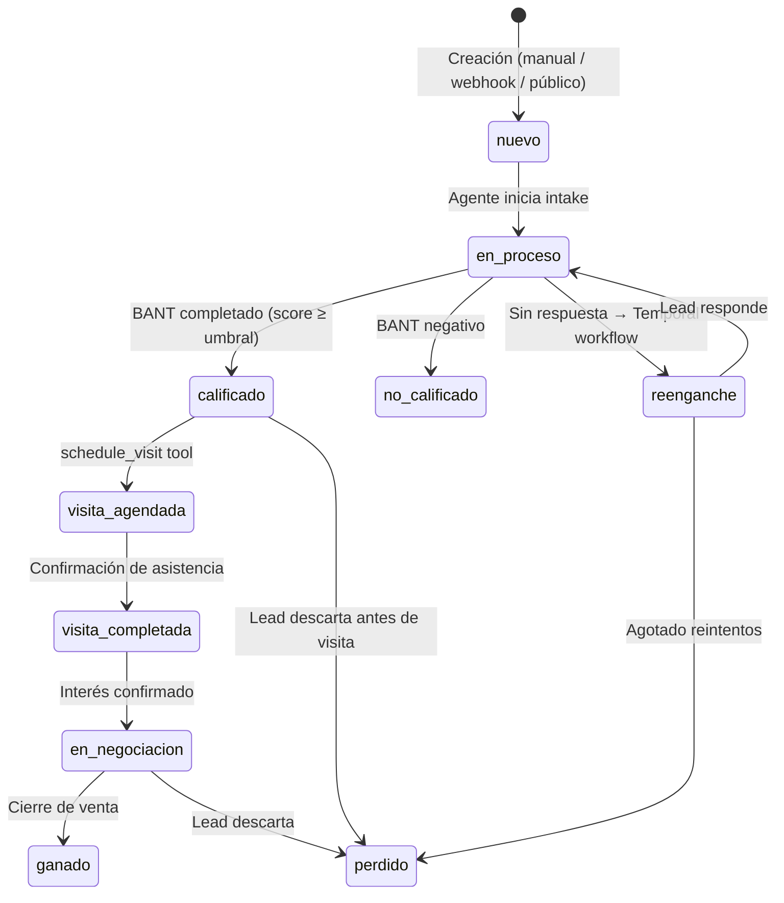
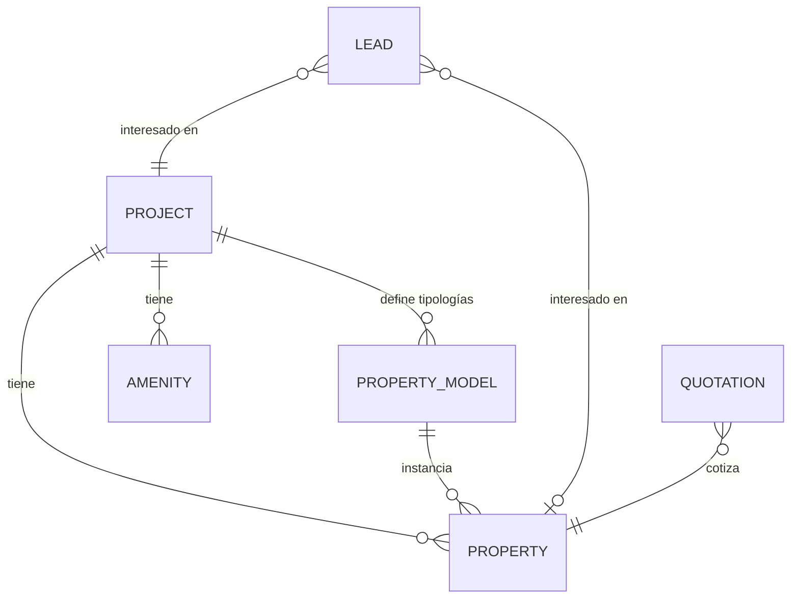
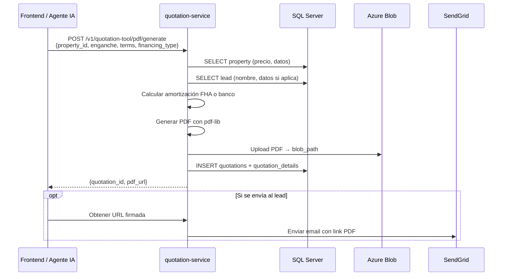
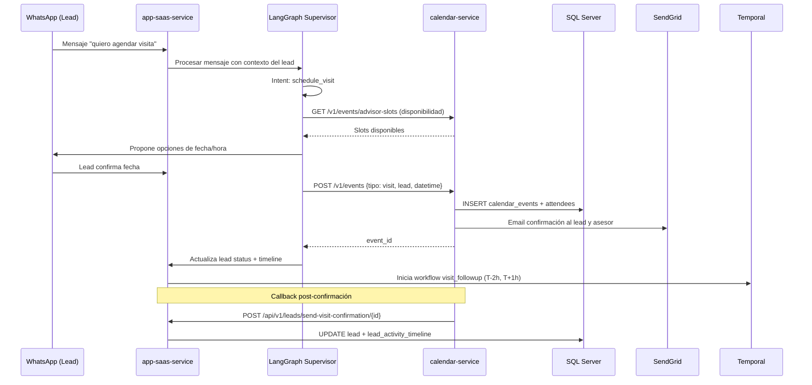
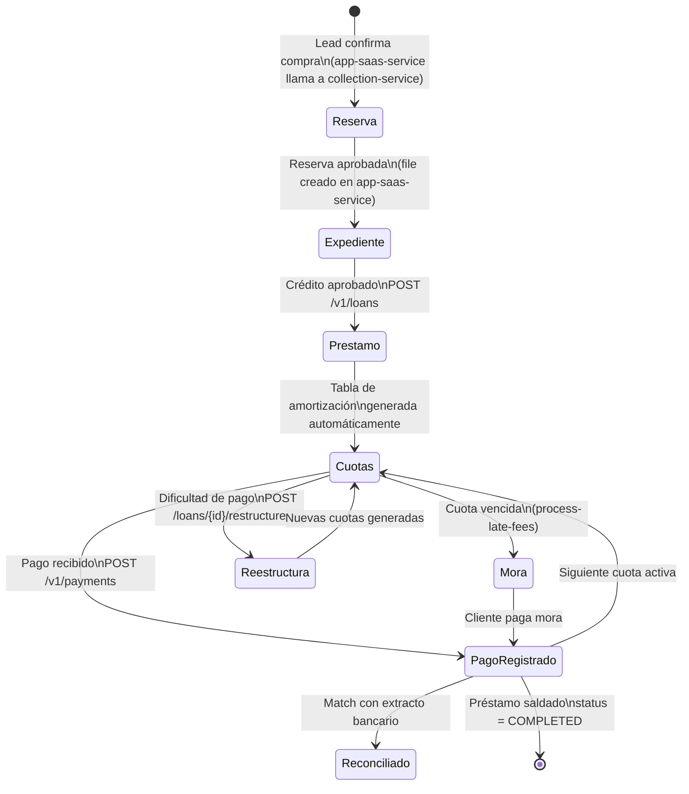
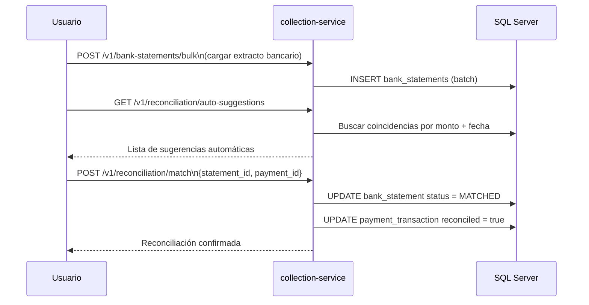

# PropFlow — Business Flows

Documentación de los principales flujos de negocio del sistema. Basada en análisis directo del código fuente.

---

## Índice

1. [Flujo de Leads](#1-flujo-de-leads)
2. [Flujo de Propiedades](#2-flujo-de-propiedades)
3. [Flujo de Cotizaciones](#3-flujo-de-cotizaciones)
4. [Flujo de Calendario](#4-flujo-de-calendario)
5. [Flujo de Cobranza (Collections)](#5-flujo-de-cobranza-collections)

---

## 1. Flujo de Leads

El lead es la entidad central del CRM. Representa un prospecto inmobiliario desde su captura hasta el cierre o pérdida.

### Pantallas involucradas

| Vista | Archivo |
|---|---|
| Lista de leads | `src/views/LeadsView.vue` |
| Detalle del lead | modal/panel dentro de `LeadsView.vue` |
| Conversaciones | `src/views/ConversationsView.vue` |
| Analytics de leads | `src/views/AnalyticsView.vue` |
| Dashboard | `src/views/DashboardView.vue` |
| Timeline de actividad | componente dentro de `LeadsView.vue` |

### APIs involucradas

**app-saas-service** (`/api/v1/leads`)

| Método | Endpoint | Descripción |
|---|---|---|
| `POST` | `/leads` | Crear lead manual |
| `POST` | `/leads/webhook` | Crear lead desde webhook externo (HubSpot, Zapier) |
| `POST` | `/leads/public` | Crear lead desde formulario público |
| `GET` | `/leads/v2` | Listar leads paginados con filtros |
| `GET` | `/leads/v2/filter-options` | Opciones de filtro dinámicas |
| `GET` | `/leads/export` | Exportar a Excel |
| `GET` | `/leads/stats` | Estadísticas del pipeline |
| `GET` | `/leads/search` | Búsqueda full-text |
| `GET` | `/leads/{id}` | Detalle de un lead |
| `PATCH` | `/leads/{id}` | Actualizar datos del lead |
| `PATCH` | `/leads/{id}/assign` | Asignar asesor |
| `DELETE` | `/leads/{id}` | Eliminar lead |
| `GET` | `/leads/{id}/timeline` | Historial de actividad |
| `GET` | `/leads/{id}/insights` | Análisis de sentimiento e insights |
| `GET` | `/leads/{id}/campaigns` | Campañas asociadas |
| `PATCH` | `/leads/{id}/star-rating` | Calificar con estrellas |
| `POST` | `/leads/{id}/analyze-sentiment` | Análisis de sentimiento manual |
| `POST` | `/leads/{id}/send-message` | Enviar mensaje WhatsApp/email |
| `POST` | `/leads/{id}/trigger-post-visit` | Disparar workflow post-visita |
| `POST` | `/leads/{id}/start-nurturing` | Iniciar nurturing automatizado |
| `POST` | `/leads/bulk-status-change` | Cambio de estado masivo |
| `POST` | `/leads/bulk-assign-advisor` | Asignación masiva |

### Servicios involucrados

| Servicio | Rol |
|---|---|
| `app-saas-service` | Dominio principal, CRUD, orquestación de agentes |
| `calendar-service` | Agendamiento de visitas (llamado internamente por el agente) |
| `quotation-service` | Generación de cotizaciones para el lead (llamado por el agente) |
| LangGraph Supervisor | Calificación BANT, reenganche, comunicación automática |
| Temporal | Workflows de seguimiento post-visita y reenganche |
| SendGrid | Emails al lead |
| WhatsApp Cloud API / Evolution API | Mensajería al lead |

### Modelos involucrados (app-saas-service)

| Modelo | Tabla | Descripción |
|---|---|---|
| `Lead` | `leads` | Entidad principal del prospecto |
| `LeadSource` | `lead_sources` | Catálogo de fuentes (FB, manual, Zapier…) |
| `LeadMeta` | `lead_meta` | Datos de origen de Facebook Ads |
| `LeadAuditLog` | `lead_audit_log` | Log de tracking de campañas |
| `LeadDocument` | `lead_documents` | Documentos adjuntos al lead |
| `LeadActivityTimeline` | `lead_activity_timeline` | Historial de todas las actividades |
| `LeadComment` | `lead_comments` | Comentarios internos de asesores |
| `LeadClosingInfo` | `lead_closing_info` | Información de cierre de venta |
| `LeadChannelIdentifier` | `lead_channel_identifiers` | Identificadores por canal (WhatsApp ID, email…) |
| `LeadStatusCatalog` | `lead_status_catalog` | Catálogo de estados configurables |
| `LeadTourAppointment` | `lead_tour_appointments` | Registro de citas de visita |
| `Conversation` | `conversations` | Mensajes y llamadas |
| `Contact` | `contacts` | Contacto asociado al lead |
| `File` | `files` | Expediente de crédito asociado |
| `Advisor` | `advisors` | Asesor asignado |
| `Project` | `projects` | Proyecto de interés |

### Ciclo de vida de un lead



---

## 2. Flujo de Propiedades

Las propiedades son los activos inmobiliarios que se ofrecen. Pueden pertenecer a un proyecto (desarrollo inmobiliario) o existir de forma independiente.

### Pantallas involucradas

| Vista | Archivo |
|---|---|
| Lista de propiedades | `src/views/properties/` |
| Detalle de proyecto | anidado en vistas de proyectos |
| Vista de planta / plano | `src/views/floor-plan/` |
| Masterplan de marketing | dentro de vista de proyecto |
| Mapa de propiedades | `src/views/public/` (portal público) |

### APIs involucradas

**app-saas-service** — Propiedades (`/api/v1/properties`)

| Método | Endpoint | Descripción |
|---|---|---|
| `POST` | `/properties` | Crear propiedad |
| `POST` | `/properties/bulk` | Carga masiva de propiedades |
| `GET` | `/properties` | Listar propiedades con filtros |
| `GET` | `/properties/search` | Búsqueda con filtros avanzados |
| `GET` | `/properties/{id}` | Detalle de propiedad |
| `PUT` | `/properties/{id}` | Actualizar propiedad |
| `DELETE` | `/properties/{id}` | Eliminar propiedad |
| `GET` | `/properties/{id}/floor-plan` | Plano de planta |
| `PUT` | `/properties/{id}/map-points` | Actualizar puntos en mapa |

**app-saas-service** — Proyectos (`/api/v1/projects`)

| Método | Endpoint | Descripción |
|---|---|---|
| `POST` | `/projects` | Crear proyecto |
| `GET` | `/projects` | Listar proyectos |
| `GET` | `/projects/{id}` | Detalle de proyecto |
| `PUT` | `/projects/{id}` | Actualizar proyecto |
| `DELETE` | `/projects/{id}` | Eliminar proyecto |
| `POST` | `/projects/{id}/master-plan` | Subir masterplan |

**app-saas-service** — Modelos de propiedad (`/api/v1/property-models`)

| Recurso | Descripción |
|---|---|
| `property-models` | Tipologías o modelos (ej: "Tipo A de 2 habitaciones") |
| `property-models-img` | Imágenes por modelo |
| `property-models-video` | Videos por modelo |
| `property-models-floor-plans` | Planos por modelo |
| `property-models-tech-docs` | Documentos técnicos |
| `property-models-text` | Contenidos de texto (descripciones, specs) |

### Servicios involucrados

| Servicio | Rol |
|---|---|
| `app-saas-service` | Dominio principal de propiedades y proyectos |
| Azure Blob Storage | Almacenamiento de imágenes, planos, videos |
| Pinecone | Vector store para RAG (búsqueda semántica por propiedades) |
| `quotation-service` | Lee propiedades para generar cotizaciones |

### Modelos involucrados

| Modelo | Tabla | Descripción |
|---|---|---|
| `Project` | `projects` | Desarrollo inmobiliario (condominio, torre, etc.) |
| `Property` | `properties` | Unidad individual (apartamento, casa, lote…) |
| `PropertyModel` | `property_models` | Tipología de propiedad dentro de un proyecto |
| `PropertyImage` | `property_images` | Imágenes de propiedad individual |
| `Amenity` | `amenities` | Amenidades de un proyecto |
| `AmenityCatalog` | `amenity_catalog` | Catálogo de tipos de amenidades del tenant |
| `ProjectVideo` | `project_videos` | Videos del proyecto |

### Relación entre entidades



---

## 3. Flujo de Cotizaciones

Una cotización es un PDF generado para una propiedad específica con cálculos de financiamiento. Puede generarse desde la UI (manual) o por un agente de IA (agentic).

### Pantallas involucradas

| Vista | Archivo |
|---|---|
| Generar cotización | `src/views/QuotationView.vue` |
| Lista de cotizaciones | `src/views/quotations/` |
| Vista dentro de lead | panel de cotizaciones en `LeadsView.vue` |
| Configuración de cotizaciones | dentro de `SettingsView.vue` |

### APIs involucradas

**quotation-service** (`/v1/quotation-tool`)

| Método | Endpoint | Descripción |
|---|---|---|
| `POST` | `/quotation-tool/pdf/generate` | Generar PDF (FHA o banco convencional) |
| `POST` | `/quotation-tool/pdf/generate-lip` | Generar PDF de Letras de Interés Preferencial |
| `GET` | `/quotation-tool/pdf/list` | Listar cotizaciones del tenant |
| `GET` | `/quotation-tool/pdf/quotation/{id}` | Detalle de una cotización |
| `GET` | `/quotation-tool/pdf/download/{id}` | Descargar PDF |
| `GET` | `/quotation-tool/pdf/url/{id}` | URL firmada del PDF en Azure Blob |
| `GET` | `/quotation-tool/quotation/stats` | Estadísticas de cotizaciones |
| `PATCH` | `/quotation-tool/quotation/{id}/status` | Actualizar estado |
| `GET` | `/quotation-configs/{tenantId}/resolve` | Resolver configuración activa (jerarquía tenant → proyecto) |
| `PUT` | `/quotation-configs/{tenantId}` | Guardar config del tenant |
| `PUT` | `/quotation-configs/{tenantId}/projects/{projectId}` | Guardar config por proyecto |
| `POST` | `/simulate` | Simular cálculo sin generar PDF |

**app-saas-service** (llamadas internas al quotation-service)

| Endpoint | Cuándo |
|---|---|
| `POST /api/v1/files/from-quotation` | Convertir cotización en expediente (reserva) |

### Servicios involucrados

| Servicio | Rol |
|---|---|
| `quotation-service` | Dominio principal: generación de PDF y cálculos |
| Azure Blob Storage | Almacenamiento del PDF generado |
| `app-saas-service` | Llama a quotation-service vía `QuotationService` (httpx) cuando el agente genera cotizaciones |
| MCP Server (quotation-mcp) | Permite a LLMs generar cotizaciones directamente |
| SendGrid | Envío de la cotización al lead por email |

### Modelos involucrados

**quotation-service** (SQL Server, leído directamente por Sequelize):

| Entidad Sequelize | Tabla | Descripción |
|---|---|---|
| `Quotation` | `quotations` | Registro de cada cotización generada |
| `QuotationDetails` | `quotation_details` | Detalle de plazos calculados |
| `QuotationConfig` | (tabla config) | Configuración de parámetros financieros por tenant/proyecto |
| `Property` | `properties` | Leída para obtener precio base |
| `Lead` | `leads` | Datos del cliente en el PDF |
| `Advisor` | `advisors` | Datos del asesor en el PDF |
| `ProjectImage` | `project_images` | Imagen del proyecto en el PDF |

### Campos clave del modelo `Quotation`

```
quotation_id    UUID único
tenant_id       Tenant
lead_id         Lead asociado (nullable — puede ser sin lead)
property_id     Propiedad cotizada
pdf_blob_path   Ruta del PDF en Azure Blob
enganche        Monto de enganche
precio          Precio de la propiedad al momento
selected_terms  Plazos incluidos ("15,20,25")
status          PENDING | SENT | CONVERTED
source          'manual' (UI) | 'agentic' (MCP/agente)
```

### Flujo de generación



### Configuración de parámetros (jerarquía de resolución)

```
Proyecto (project config) → Tenant (tenant config) → Variables de entorno
```
El endpoint `/quotation-configs/{tenantId}/resolve` aplica esta jerarquía automáticamente.

---

## 4. Flujo de Calendario

Gestión de calendarios, eventos de visita y agenda de asesores. Es el puente entre el mundo CRM y la agenda real.

### Pantallas involucradas

| Vista | Archivo |
|---|---|
| Vista de calendario | `src/views/CalendarView.vue` |
| Eventos dentro de lead | panel de eventos en `LeadsView.vue` |

### APIs involucradas

**calendar-service** (`/v1/`)

**Calendarios:**

| Método | Endpoint | Descripción |
|---|---|---|
| `GET` | `/calendars` | Listar todos los calendarios del tenant |
| `GET` | `/calendars/visible` | Solo calendarios visibles |
| `GET` | `/calendars/default` | Calendario por defecto |
| `GET` | `/calendars/lead/{leadId}` | Calendarios asociados a un lead |
| `GET` | `/calendars/type/{type}` | Por tipo (personal, shared, public…) |
| `POST` | `/calendars` | Crear calendario |
| `PUT` | `/calendars/{id}/set-default` | Marcar como default |
| `PUT` | `/calendars/{id}/toggle-visibility` | Mostrar/ocultar |
| `PUT` | `/calendars/reorder` | Reordenar |

**Eventos:**

| Método | Endpoint | Descripción |
|---|---|---|
| `POST` | `/events` | Crear evento |
| `GET` | `/events/range` | Eventos en rango de fechas |
| `GET` | `/events/upcoming` | Próximos eventos |
| `GET` | `/events/recurring` | Eventos recurrentes |
| `GET` | `/events/lead/{leadId}` | Eventos de un lead |
| `GET` | `/events/search` | Búsqueda de eventos |
| `GET` | `/events/advisor-slots` | Slots disponibles de asesores |
| `GET` | `/events/project-hour-counts` | Conteo de citas por hora y proyecto |
| `GET` | `/events/leads/confirmed-upcoming` | Leads con visitas próximas confirmadas |
| `GET` | `/events/{id}` | Detalle de evento |
| `PUT` | `/events/{id}/manage` | Actualizar evento |
| `DELETE` | `/events/{id}` | Eliminar evento |

**Asistentes:**

| Método | Endpoint | Descripción |
|---|---|---|
| `GET` | `/attendees/search` | Buscar asistentes por email/nombre |
| `GET` | `/events/{id}/attendees` | Asistentes de un evento |
| `POST` | `/events/{id}/attendees` | Agregar asistentes |

**Callback a app-saas-service (server-to-server):**

| Método | Endpoint | Cuándo |
|---|---|---|
| `POST` | `/api/v1/leads/send-visit-confirmation/{id}` | Al confirmar visita (en app-saas-service) |
| `POST` | `/api/v1/leads/tour-rescheduled` | Al reagendar visita |

### Servicios involucrados

| Servicio | Rol |
|---|---|
| `calendar-service` | Dominio principal de calendarios y eventos |
| `app-saas-service` | Orquesta la creación de eventos vía agente IA; recibe callbacks |
| MCP Server (calendar-mcp) | Permite a LLMs crear/consultar eventos directamente |
| SendGrid | Notificaciones de confirmación de visita a lead y asesor |
| Temporal | `visit_followup`, `visit_overdue` — workflows post-evento |

### Modelos involucrados

**calendar-service** (SQL Server, schema `calendars`):

| Entidad Sequelize | Tabla | Descripción |
|---|---|---|
| `Calendar` | `calendars.calendars` | Calendarios del tenant |
| `CalendarEvent` | `calendars.calendar_events` | Eventos (visita, llamada, reunión…) |
| `CalendarEventAttendee` | `calendars.calendar_event_attendees` | Asistentes del evento |

**Campos clave de `CalendarEvent`:**

```
id              UUID
calendar_id     FK → calendars
tenant_id       Multitenancy
title           Título del evento
start_datetime  Inicio
end_datetime    Fin (visitas: 1h duración)
event_type      visit | meeting | appointment | calling | email | document | other
event_origin    agente_call | agente_whatsapp | control_manual
is_recurring    Boolean
recurrence_pattern  JSON con regla de recurrencia
lead_id         Lead asociado (vía attendees)
meeting_url     URL de videollamada (si aplica)
```

### Flujo completo: agendar visita vía agente IA



---

## 5. Flujo de Cobranza (Collections)

Gestión del ciclo de vida financiero de una venta inmobiliaria: desde la reserva inicial hasta el préstamo, cuotas, pagos y reconciliación bancaria.

### Pantallas involucradas

| Vista | Archivo |
|---|---|
| Vista de cobranza | `src/views/CollectionsView.vue` |
| Vista bancaria | `src/views/BankView.vue` |
| Formularios dinámicos | `src/views/FormTemplateView.vue`, `FormTemplateEditorView.vue`, `FormTemplateFillView.vue` |
| Ficha del cliente | `src/views/contacts/CustomerCardView.vue` |

### APIs involucradas

**collection-service** (`/v1/`)

**Reservas:**

| Método | Endpoint | Descripción |
|---|---|---|
| `POST` | `/reservations` | Crear reserva de pago inicial |
| `GET` | `/reservations/by-file/{fileId}` | Reserva asociada a un expediente |
| `PATCH` | `/reservations/{id}/release` | Liberar reserva |
| `GET` | `/reservations/{id}/receipt/pdf` | PDF del recibo de reserva |

**Préstamos:**

| Método | Endpoint | Descripción |
|---|---|---|
| `POST` | `/loans` | Crear préstamo |
| `GET` | `/loans` | Listar préstamos |
| `GET` | `/loans/{id}` | Detalle |
| `GET` | `/loans/{id}/summary` | Resumen financiero |
| `PATCH` | `/loans/{id}/status` | Cambiar estado |
| `GET` | `/loans/stats` | Estadísticas globales |
| `GET` | `/loans/by-file/{fileId}` | Préstamo por expediente |

**Cuotas (bajo `/loans/{id}/installments`):**

| Método | Endpoint | Descripción |
|---|---|---|
| `GET` | `/loans/{id}/installments` | Tabla de amortización |
| `GET` | `/loans/{id}/installments/overdue` | Cuotas vencidas |
| `GET` | `/loans/{id}/installments/upcoming` | Cuotas próximas |
| `GET` | `/loans/{id}/account-statement` | Estado de cuenta |
| `POST` | `/loans/{id}/restructure` | Reestructurar cuotas |

**Pagos:**

| Método | Endpoint | Descripción |
|---|---|---|
| `POST` | `/payments` | Registrar pago (con voucher) |
| `POST` | `/payments/manual` | Pago manual |
| `GET` | `/payments` | Listar pagos |
| `GET` | `/payments/today` | Pagos del día |
| `GET` | `/payments/{id}/details` | Detalle con aplicaciones |
| `GET` | `/payments/{id}/receipt` | Recibo del pago |
| `POST` | `/payments/{id}/reverse` | Reversar pago |

**Cargos adicionales:**

| Método | Endpoint | Descripción |
|---|---|---|
| `GET` | `/loans/{id}/charges` | Cargos del préstamo |
| `POST` | `/charges/process-late-fees` | Procesar moras |
| `PATCH` | `/charges/{id}/waive` | Condonar cargo |

**Extractos bancarios y reconciliación:**

| Método | Endpoint | Descripción |
|---|---|---|
| `POST` | `/bank-statements` | Cargar extracto individual |
| `POST` | `/bank-statements/bulk` | Carga masiva de extractos |
| `GET` | `/bank-statements/batches` | Lotes de carga |
| `GET` | `/reconciliation/pending` | Movimientos sin reconciliar |
| `GET` | `/reconciliation/auto-suggestions` | Sugerencias automáticas |
| `POST` | `/reconciliation/match` | Reconciliar movimiento con pago |
| `POST` | `/reconciliation/bulk` | Reconciliación masiva |
| `POST` | `/reconciliation/undo/{id}` | Deshacer reconciliación |

**Plantillas de formularios:**

| Método | Endpoint | Descripción |
|---|---|---|
| `POST` | `/form-templates` | Crear plantilla |
| `GET` | `/form-templates/{id}/fields` | Campos de la plantilla |
| `POST` | `/form-templates/{id}/generate` | Generar documento con datos del lead |
| `POST` | `/form-templates/{id}/autofill/{fileId}` | Autocompletar con datos del expediente |

**Ficha del cliente (Customer Card):**

| Método | Endpoint | Descripción |
|---|---|---|
| `GET` | `/customer-card-config/sections` | Secciones configuradas |
| `GET` | `/contacts/{contactId}/customer-card` | Ficha de un contacto |
| `PUT` | `/contacts/{contactId}/customer-card/values` | Actualizar valores |

### Servicios involucrados

| Servicio | Rol |
|---|---|
| `collection-service` | Dominio financiero completo |
| `app-saas-service` | Crea reservas vía `CollectionService` (httpx); gestiona expedientes (`files`) |
| Azure Blob Storage | PDFs de recibos, documentos OCR, vouchers de pago |
| OCR (via app-saas-service) | Extracción de datos de documentos |

### Modelos involucrados

**collection-service** (SQL Server, schema `collections`):

| Entidad Sequelize | Tabla | Descripción |
|---|---|---|
| `PaymentReservation` | `collections.payment_reservations` | Reserva de compra inicial |
| `PaymentReceipt` | `collections.payment_receipts` | Recibo de reserva |
| `Loan` | `collections.loans` | Préstamo hipotecario |
| `Installment` | `collections.installments` | Cuotas del préstamo |
| `InstallmentRestructure` | `collections.installment_restructures` | Historial de reestructuras |
| `PaymentTransaction` | `collections.payment_transactions` | Pagos registrados |
| `PaymentApplication` | `collections.payment_applications` | Aplicación de pago a cuota/cargo |
| `Charge` | `collections.charges` | Cargos adicionales (mora, comisión…) |
| `BankStatement` | `collections.bank_statements` | Movimientos bancarios importados |
| `FormTemplate` | `collections.form_templates` | Plantillas de formularios |
| `FormTemplateField` | `collections.form_template_fields` | Campos de las plantillas |
| `CustomerCardConfig` | `collections.customer_card_config` | Secciones configurables de ficha |
| `CustomerCardValue` | `collections.customer_card_values` | Valores por contacto |

**app-saas-service** (entidades relacionadas):

| Modelo | Tabla | Descripción |
|---|---|---|
| `File` | `files` | Expediente de crédito (UUID como FK compartida con collection) |
| `Lead` | `leads` | Lead que genera la cobranza |
| `Contact` | `contacts` | Contacto asociado a la ficha |

### Campos clave del modelo `Loan`

```
loan_number             Número único del préstamo
file_id                 UUID del expediente (FK compartida con app-saas-service)
lead_id                 Lead comprador
principal_amount        Monto total de la propiedad
down_payment_amount     Enganche
financed_amount         Monto financiado
interest_rate           Tasa de interés
late_fee_type           'FIXED' | 'PERCENTAGE'
late_fee_value          Valor de la mora
payment_day             Día de pago mensual
start_date              Inicio del préstamo
financing_installments  Número de cuotas
monthly_payment         Cuota mensual calculada
status                  ACTIVE | COMPLETED | DEFAULTED | CANCELLED
current_balance         Saldo actual
total_paid              Total pagado
```

### Flujo completo: ciclo de cobranza



### Reconciliación bancaria


