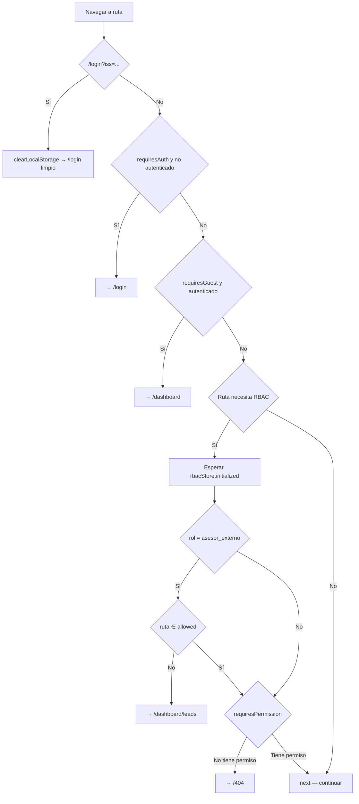
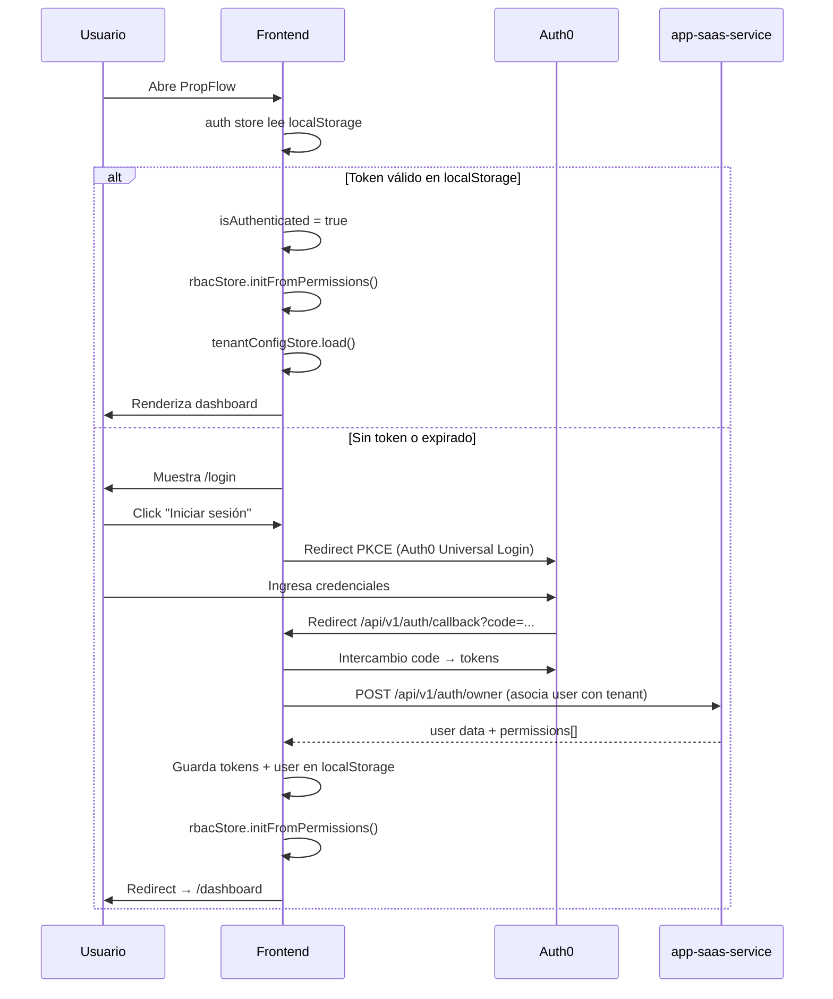
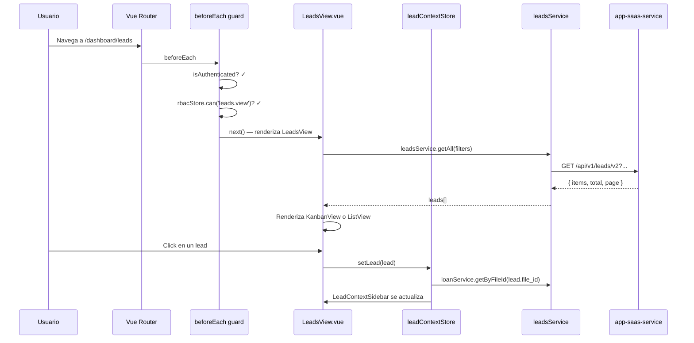

# PropFlow Frontend — Guía de desarrollo

Referencia técnica del repositorio `app-saas-frontend`. Basada en análisis directo del código fuente.

---

## Índice

1. [Stack y configuración](#1-stack-y-configuración)
2. [Estructura del proyecto](#2-estructura-del-proyecto)
3. [Routing](#3-routing)
4. [Stores (Pinia)](#4-stores-pinia)
5. [Servicios HTTP](#5-servicios-http)
6. [Composables](#6-composables)
7. [Componentes compartidos](#7-componentes-compartidos)
8. [Sistema de permisos (RBAC)](#8-sistema-de-permisos-rbac)
9. [Internacionalización (i18n)](#9-internacionalización-i18n)
10. [Tipos TypeScript](#10-tipos-typescript)
11. [Tiempo real (SSE)](#11-tiempo-real-sse)
12. [Convenciones](#12-convenciones)
13. [Flujo de navegación](#13-flujo-de-navegación)

---

## 1. Stack y configuración

| Tecnología | Versión / Rol |
|---|---|
| Vue 3 | Framework principal (Composition API + `<script setup>`) |
| Vite | Build tool y servidor de desarrollo |
| TypeScript | Tipado estático en todos los archivos |
| Pinia | Estado global (stores) |
| Vue Router | Navegación SPA |
| Tailwind CSS | Estilos utilitarios con tema personalizado |
| Auth0 SPA SDK | Autenticación (PKCE flow) |
| vue-i18n | Internacionalización (ES / EN) |
| Tiptap | Editor de texto enriquecido |
| Vue Flow | Editor de flujos / diagramas |
| Chart.js | Gráficas analíticas |
| Konva | Canvas interactivo (plano de planta) |
| Vitest | Tests unitarios |

**Variables de entorno requeridas:**
```
VITE_API_BASE_URL            # app-saas-service (ej: http://localhost:8000)
VITE_CALENDAR_API_BASE_URL   # calendar-service (ej: http://localhost:3002)
VITE_QUOTATION_API_BASE_URL  # quotation-service (ej: http://localhost:3008)
VITE_COLLECTION_API_BASE_URL # collection-service (ej: http://localhost:3010)
VITE_AUTH0_DOMAIN            # Auth0 domain
VITE_AUTH0_CLIENT_ID         # Auth0 client ID
VITE_AUTH0_AUDIENCE          # Auth0 audience (API identifier)
```

**Alias configurado en Vite:**
```ts
'@' → src/
```

---

## 2. Estructura del proyecto

```
src/
├── App.vue                  # Raíz: <RouterView /> + <ToastContainer />
├── main.ts                  # Plugins: Pinia, Router, i18n, VueKonva, v-permission
├── i18n.ts                  # Setup de vue-i18n (ES/EN, lazy por módulo)
│
├── assets/                  # CSS global, imágenes estáticas
├── data/                    # Datos estáticos (ej: agents.ts)
│
├── router/
│   └── index.ts             # Rutas + navigation guards
│
├── layouts/
│   └── DashboardLayout.vue  # Sidebar + header envolvente para todas las rutas /dashboard/*
│
├── views/                   # Vistas (una por ruta)
│   ├── auth/                # Login, Callback, Onboarding, ChangePassword
│   ├── public/              # Páginas sin auth (mapa, portal, ficha cliente)
│   ├── properties/          # Proyectos, propiedades, modelos, planos
│   ├── postventa/           # Expedientes, configuración postventa
│   ├── advisors/            # Lista, mapa, monitoring
│   ├── advisor-chat/        # Chat del asesor
│   ├── distribution-lists/  # Listas y campañas de marketing
│   ├── floor-plan/          # Editor de plano interactivo (Konva)
│   ├── milestones/          # Hitos de proyecto
│   ├── calls/               # Registro de llamadas
│   ├── contacts/            # Contactos y ficha del cliente
│   ├── activity-log/        # Auditoría de actividad
│   ├── downloads/           # Descargas generadas
│   ├── files/               # Detalle de expediente (file)
│   └── [vistas planas]      # LeadsView, CalendarView, QuotationView, CollectionsView…
│
├── components/              # Componentes reutilizables por dominio
│   ├── ui/                  # ToastContainer, ToastItem
│   ├── Leads/               # KanbanView, KanbanColumn, LeadCard, ListView…
│   ├── calendar/            # EventModal, CalendarModal, AttendeesModal
│   ├── collections/         # Tabs y modals de cobranza
│   ├── bank/                # Tabs y modals bancarios
│   ├── postventa/           # BandejaAvisos, tabs de expediente
│   ├── quotations/          # Componentes de cotizaciones
│   ├── notifications/       # NotificationBell y panel
│   └── [un dir por dominio]
│
├── stores/                  # Estado global Pinia
├── services/                # Clientes HTTP por entidad
├── composables/             # Lógica reutilizable
├── directives/              # v-permission
├── types/                   # Interfaces y tipos TypeScript
├── utils/                   # Helpers puros (formatting, status, timezones…)
└── locales/                 # Traducciones ES/EN por módulo
```

---

## 3. Routing

El router usa `createWebHistory` (HTML5 history API, sin hash).

### Estructura de rutas

```
/                          → redirect /dashboard
/login                     → LoginView (requiresGuest)
/cambiar-password          → ChangePasswordView (requiresAuth)
/api/v1/auth/callback      → AuthCallback (redirect de Auth0)
/onboarding                → OnboardingView
/404                       → NotFoundView

# Rutas públicas (sin auth)
/map/:projectId            → PublicMapView
/upload                    → FileUploadView
/form/:shortCode           → PublicCustomerCardView
/project/:projectId        → PublicListingView
/privacy-policy            → PrivacyPolicyView

# Dashboard (requiresAuth, envuelto en DashboardLayout)
/dashboard
  /leads                   → LeadsView          [leads.view]
  /conversations           → ConversationsView  [leads.view]
  /contacts                → contacts/index     [contacts.view]
  /contacts/customer-card  → CustomerCardView   [contacts.view]
  /advisors                → advisors/index     [advisors.view]
  /advisors/map            → advisors/map
  /advisors/monitoring     → advisors/monitoring
  /advisor-chat            → advisor-chat/index [advisors.view]
  /advisor-performance     → AdvisorPerformanceView [advisor_performance.view]
  /campaigns               → CampaignsView
  /distribution-lists      → DistributionListsView
  /calendar                → CalendarView
  /tasks                   → TasksView          [tasks.view]
  /calls                   → calls/index
  /emails                  → EmailsView
  /quotation               → QuotationView      [cotizaciones.view]
  /collections             → CollectionsView
  /bank                    → BankView
  /fha                     → FHAView
  /fha/expediente/:id      → FHAView (con prop)
  /postventa               → PostventaView      [postventa.view]
  /postventa/expedientes/:id → ExpedienteDetailView [postventa.view]
  /postventa/avisos        → BandejaAvisos      [postventa.view]
  /postventa/configuracion → PostventaConfigView [postventa.admin]
  /properties              → ProjectsView
  /projects/:id/...        → Vistas de proyecto (context, properties, knowledge…)
  /projects/:id/floor-plan → floor-plan/index
  /files/:id               → FileDetailView
  /legal                   → FormTemplateView
  /legal-editor            → FormTemplateEditorView
  /agents                  → AgentsView
  /agents/:id/training     → AgentTrainingView
  /users                   → UsersView          [users.view]
  /roles                   → RolesView          [users.manage_roles]
  /settings                → SettingsView
  /connections             → ConnectionsView
  /notifications           → NotificationsView
  /activity-log            → activity-log/index
  /downloads               → downloads/index
```

### Navigation guards

El guard `router.beforeEach` ejecuta en orden:



**Meta flags disponibles en rutas:**
- `requiresAuth: true` — requiere estar autenticado
- `requiresGuest: true` — solo si NO está autenticado (login)
- `requiresPermission: 'entidad.accion'` — verificado contra RBAC
- `public: true` — sin auth, sin layout de dashboard

---

## 4. Stores (Pinia)

Todos usan la Composition API de Pinia (`defineStore('id', () => { ... })`). Ningún store usa la Options API.

### Mapa de stores

| Store | Archivo | Propósito |
|---|---|---|
| `auth` | `auth.ts` | Usuario, tokens, autenticación, inicialización desde localStorage |
| `rbac` | `rbac.ts` | Permisos del usuario, roles, `can()`, `canAny()`, `canAll()`, `hasRole()` |
| `tenantConfig` | `tenantConfig.ts` | Configuración del tenant (timezone, OCR, video) |
| `leadContext` | `leadContext.ts` | Lead actualmente seleccionado, con datos relacionados (loan, file, insights) |
| `leadStatus` | `leadStatus.ts` | Catálogo de estados de lead |
| `leadsStats` | `leadsStats.ts` | Estadísticas del pipeline (conteos por estado) |
| `leadVisitDates` | `leadVisitDates.ts` | Fechas de visita de leads |
| `confirmedVisits` | `confirmedVisits.ts` | Leads con visitas próximas confirmadas |
| `calendar` | `calendar.ts` | Calendarios cargados |
| `event` | `event.ts` | Eventos del calendario |
| `attendee` | `attendee.ts` | Asistentes de eventos |
| `notifications` | `notifications.ts` | Conexión SSE para notificaciones en tiempo real |
| `notificationFeed` | `notificationFeed.ts` | Bandeja de notificaciones |
| `notificationAdmin` | `notificationAdmin.ts` | Administración de notificaciones |
| `notificationPreferences` | `notificationPreferences.ts` | Preferencias del usuario |
| `alert` | `alert.ts` | Modal de alerta/confirmación global |
| `follow` | `follow.ts` | Seguimiento (follow) de entidades |
| `followUpPrompt` | `followUpPrompt.ts` | Prompt de seguimiento de conversaciones |
| `metaMessaging` | `metaMessaging.ts` | Estado de mensajería Meta/WhatsApp |
| `expedienteContext` | `expedienteContext.ts` | Expediente activo en postventa |
| `postventa` | `postventa.ts` | Estado de la vista postventa |
| `postventaInbox` | `postventaInbox.ts` | Bandeja de observaciones postventa |
| `postventaPrefs` | `postventaPrefs.ts` | Preferencias de postventa del usuario |
| `fha` | `fha.ts` | Estado del módulo FHA |
| `slack` | `slack.ts` | Integración Slack |

### Patrón de un store típico

```ts
// stores/leadContext.ts (simplificado)
import { defineStore } from 'pinia'
import { ref, computed } from 'vue'

export const useLeadContextStore = defineStore('leadContext', () => {
  // State
  const lead = ref<Lead | null>(null)
  const loan = ref<Loan | null>(null)
  const loading = ref(false)

  // Computed
  const hasFile = computed(() => !!lead.value?.file_id)

  // Actions
  async function setLead(newLead: Lead) {
    lead.value = newLead
    if (newLead.file_id) {
      loan.value = await loanService.getByFileId(newLead.file_id)
    }
  }

  function clear() {
    lead.value = null
    loan.value = null
  }

  return { lead, loan, loading, hasFile, setLead, clear }
})
```

### Inicialización del store `auth`

El store `auth` se auto-inicializa desde `localStorage` en cuanto se instancia. No requiere llamada explícita. En el guard del router se espera a `rbacStore.initialized` antes de evaluar permisos de ruta.

```
Inicio de app
  → Pinia crea stores
  → auth store lee localStorage (token, user, tenant_id)
  → llama rbacStore.initFromPermissions() o initUserPermissions()
  → llama tenantConfigStore.load()
  → router guard espera rbacStore.initialized antes de navegar
```

---

## 5. Servicios HTTP

Todos los servicios importan sus fetch helpers desde `src/services/api.config.ts`.

### Los cuatro fetch helpers

```ts
// api.config.ts — cada uno apunta a un backend diferente

apiFetch(endpoint, options)
// → app-saas-service :8000/api/v1{endpoint}
// Agrega: Authorization: Bearer <token> + X-Tenant-ID

calendarApiFetch(endpoint, options)
// → calendar-service :3002/v1{endpoint}
// Agrega: Authorization: Bearer <token> + X-Tenant-ID

quotationApiFetch(endpoint, options)
// → quotation-service :3008/v1{endpoint}
// Agrega: Authorization: Bearer <token> + X-Tenant-ID

collectionApiFetch(endpoint, options)
// → collection-service :3010/v1{endpoint}
// Agrega: Authorization: Bearer <token> + X-Tenant-ID
```

**Helpers adicionales:**

| Helper | Uso |
|---|---|
| `apiUpload(endpoint, formData)` | POST multipart/form-data a app-saas-service |
| `apiUploadWithProgress(endpoint, formData, onProgress)` | Upload con barra de progreso (XMLHttpRequest) |
| `collectionApiUpload(endpoint, formData)` | POST multipart/form-data a collection-service |
| `apiFetchBlob(endpoint, options)` | Descarga de archivos binarios |

### Tokens y tenant

El token Auth0 se obtiene de `localStorage('auth0_access_token')`. Si expira, `auth0Service.getAccessToken()` lo renueva automáticamente usando el refresh token antes de cada petición.

El `tenant_id` se lee de `localStorage('tenant_id')`.

### Mapa de servicios por dominio

| Archivo servicio | Backend | Dominio |
|---|---|---|
| `leads.service.ts` | app-saas-service | Leads, pipeline, BANT |
| `contacts.service.ts` | app-saas-service | Contactos |
| `advisors.service.ts` | app-saas-service | Asesores |
| `projects.service.ts` | app-saas-service | Proyectos |
| `property.service.ts` | app-saas-service | Propiedades |
| `property-models.service.ts` | app-saas-service | Modelos de propiedad |
| `analytics.service.ts` | app-saas-service | Analytics |
| `conversations.service.ts` | app-saas-service | Conversaciones |
| `whatsapp.service.ts` | app-saas-service | WhatsApp / Meta |
| `calls.service.ts` | app-saas-service | Llamadas |
| `tasks.service.ts` | app-saas-service | Tareas |
| `notifications.service.ts` | app-saas-service | Notificaciones |
| `postventa.service.ts` | app-saas-service | Expedientes postventa |
| `fha.service.ts` | app-saas-service | FHA / financiamiento |
| `files.service.ts` | app-saas-service | Expedientes (files) |
| `agents.service.ts` | app-saas-service | Configuración de agentes IA |
| `rbac.service.ts` | app-saas-service | Roles y permisos |
| `tenants.service.ts` | app-saas-service | Config del tenant |
| `Users.service.ts` | app-saas-service | Usuarios |
| `calendar.service.ts` | calendar-service | Calendarios y eventos |
| `quotation.service.ts` | quotation-service | Cotizaciones y PDFs |
| `collection.service.ts` | collection-service | Préstamos, cuotas, pagos |
| `bank.service.ts` | collection-service | Extractos y reconciliación |
| `reservations.service.ts` | collection-service | Reservas de pago |
| `formTemplate.service.ts` | collection-service | Plantillas de formularios |
| `CustomerCard.service.ts` | collection-service | Config de ficha del cliente |
| `CustomerCardValue.service.ts` | collection-service | Valores de ficha |

### API_ENDPOINTS

`api.config.ts` exporta un objeto `API_ENDPOINTS` con todas las rutas tipadas:

```ts
// Ejemplos de uso
API_ENDPOINTS.LEADS                           // '/leads'
API_ENDPOINTS.LEAD_BY_ID(42)                  // '/leads/42'
API_ENDPOINTS.LOAN_INSTALLMENTS(loanId)       // '/loans/{id}/installments'
API_ENDPOINTS.QUOTATION_URL(quotationId)      // '/quotation-tool/pdf/url/{id}'
```

---

## 6. Composables

Lógica reutilizable extraída con Composition API. Se ubican en `src/composables/`.

| Composable | Propósito |
|---|---|
| `usePermission()` | Acceso a `can()`, `canAny()`, `canAll()`, `hasRole()` del RBAC |
| `useToast()` | Sistema de notificaciones toast (success, error, warning, info) |
| `useEventModal()` | Estado y lógica del modal de creación/edición de eventos de calendario |
| `useFileUpload()` | Lógica de carga de archivos con validación |
| `useDocumentPreview()` | Previsualización de documentos PDF/imagen |
| `useLightbox()` | Galería de imágenes con photoswipe |
| `useModelComparison()` | Comparación de modelos de propiedad |
| `useKanbanLayout()` | Cálculo de columnas y layout del kanban de leads |
| `useConversationFilters()` | Filtros de la vista de conversaciones |
| `useConversationMapper()` | Transformación de datos de conversaciones para la UI |
| `useNotificationSound()` | Sonido de nueva notificación |
| `useCampaignCosts()` | Cálculo de costos de campañas |
| `useBankFormatters()` | Formateo de datos bancarios |
| `useBankParsers()` | Parseo de archivos bancarios |
| `useCollectionFormatters()` | Formateo de datos de cobranza |
| `chat/useFileAttachments()` | Adjuntos en el chat |
| `chat/useMediaProxy()` | Proxy de medios para el chat |
| `chat/useVoiceRecorder()` | Grabación de voz en el chat |

### Patrón de uso

```vue
<script setup lang="ts">
import { usePermission } from '@/composables/usePermission'
import { useToast } from '@/composables/useToast'

const { can } = usePermission()
const { success, error } = useToast()

async function createLead() {
  if (!can('leads.create')) return
  try {
    await leadsService.create(form)
    success('Lead creado correctamente')
  } catch {
    error('Error al crear el lead')
  }
}
</script>

<template>
  <button v-if="can('leads.create')" @click="createLead">Crear</button>
</template>
```

---

## 7. Componentes compartidos

### Componentes de UI globales (`src/components/ui/`)

| Componente | Descripción |
|---|---|
| `ToastContainer.vue` | Contenedor de notificaciones toast (montado en App.vue) |
| `ToastItem.vue` | Toast individual con auto-dismiss y animación |

### Componentes de uso frecuente (raíz de `src/components/`)

| Componente | Descripción |
|---|---|
| `DataTable.vue` | Tabla de datos reutilizable con paginación y ordenamiento |
| `SearchableSelect.vue` | Select con búsqueda (Combobox) |
| `PhoneInput.vue` | Input de teléfono con selector de país |
| `LoadingSpinner.vue` | Spinner de carga |
| `LoadingCard.vue` | Skeleton de tarjeta en carga |
| `LoadingTable.vue` | Skeleton de tabla en carga |
| `AlertModal.vue` | Modal de confirmación/alerta reutilizable |
| `ActivityTimeline.vue` | Timeline de actividad de un lead |
| `NotificationBell.vue` | Campana de notificaciones con badge |
| `LeadContextSidebar.vue` | Sidebar lateral con contexto del lead activo |
| `ExpedienteModal.vue` | Modal del expediente de un lead |
| `LeadTimelineModal.vue` | Modal del timeline completo |
| `WorkflowActivityModal.vue` | Modal de actividad de workflow |
| `FrontendPagination.vue` | Paginación del lado del cliente |

### Componentes del kanban de leads (`src/components/Leads/`)

| Componente | Descripción |
|---|---|
| `KanbanView.vue` | Vista kanban completa del pipeline |
| `KanbanColumn.vue` | Columna de estado del kanban |
| `LeadCard.vue` | Tarjeta del lead en el kanban |
| `ListView.vue` | Vista de tabla alternativa al kanban |
| `ClosingModal.vue` | Modal de cierre de venta |
| `FollowButton.vue` | Botón de seguimiento de un lead |
| `StarRating.vue` | Calificación con estrellas |
| `ColumnOrderModal.vue` | Reordenar columnas del kanban |
| `TableSettings.vue` | Configuración de columnas de la tabla |

### Componentes de calendario (`src/components/calendar/`)

| Componente | Descripción |
|---|---|
| `EventModal.vue` | Crear/editar evento |
| `CalendarModal.vue` | Crear/editar calendario |
| `AttendeesModal.vue` | Gestionar asistentes del evento |
| `CalendarProjectModal.vue` | Asociar calendario a proyecto |

### Editor de plano (`src/views/floor-plan/components/`)

| Componente | Descripción |
|---|---|
| `KonvaCanvas.vue` | Canvas principal de dibujo (Konva.js) |
| `DrawingToolbar.vue` | Barra de herramientas de dibujo |
| `AssignPropertyModal.vue` | Asignar propiedad a una zona del plano |
| `SubdivisionModal.vue` | Subdividir lotes |
| `ZoomControls.vue` | Controles de zoom del canvas |

---

## 8. Sistema de permisos (RBAC)

El RBAC es un sistema de permisos basado en roles configurables por tenant. Los permisos se cargan desde el backend al iniciar sesión y se almacenan en el `rbacStore`.

### Formato de permisos

```
entidad.accion
```
Ejemplos: `leads.view`, `leads.create`, `leads.edit`, `cotizaciones.view`, `postventa.admin`, `users.manage_roles`.

### Tres mecanismos para verificar permisos

**1. Composable `usePermission()`** — en `<script setup>`:
```ts
const { can, canAny, canAll, hasRole } = usePermission()

if (!can('leads.create')) return
if (canAny('leads.edit', 'leads.create')) { ... }
if (hasRole('owner')) { ... }
```

**2. Directiva `v-permission`** — en templates:
```html
<!-- Un permiso (OR si array) -->
<button v-permission="'leads.create'">Crear lead</button>

<!-- Múltiples (OR — basta uno) -->
<div v-permission="['leads.create', 'leads.edit']">...</div>

<!-- Múltiples (AND — todos requeridos) -->
<div v-permission.all="['leads.create', 'leads.edit']">...</div>
```

La directiva **oculta el elemento del DOM** (`display: none`) si no se tienen los permisos. Se re-evalúa en `updated`.

**3. Meta en rutas** — `requiresPermission`:
```ts
{
  path: 'leads',
  component: LeadsView,
  meta: { requiresAuth: true, requiresPermission: 'leads.view' }
}
```
El guard redirige a `/404` si el usuario no tiene el permiso.

### Roles especiales

| Rol | Comportamiento especial |
|---|---|
| `asesor_externo` | Restringido a `/dashboard/leads` y `/dashboard/conversations`. El guard lo redirige automáticamente si intenta acceder a cualquier otra ruta. |
| `owner` / `admin` / `manager` | Pueden llamar a `fetchRoles()` para administrar roles del tenant. |

---

## 9. Internacionalización (i18n)

**Framework:** `vue-i18n` en modo Composition API (`legacy: false`, `globalInjection: true`).

**Idiomas:** Español (`es`) y Inglés (`en`). Por defecto español; detecta el idioma del navegador si no hay preferencia guardada.

**Estructura de archivos:**
```
src/locales/
  es.json          # Claves base en español
  en.json          # Claves base en inglés
  es/              # Módulos por dominio
    leads.ts
    calendar.ts
    postventa.ts
    ... (26+ módulos)
  en/              # Traducción inglés por módulo
```

**Uso en componentes:**
```vue
<script setup lang="ts">
import { useI18n } from 'vue-i18n'
const { t } = useI18n()
</script>

<template>
  <h1>{{ t('leads.title') }}</h1>
  <p>{{ t('calendar.event.create') }}</p>
</template>
```

**Cambiar idioma programáticamente:**
```ts
import { switchLanguage } from '@/i18n'
switchLanguage('en')  // Guarda en localStorage('propflow-locale')
```

---

## 10. Tipos TypeScript

Todos los tipos se ubican en `src/types/`. Hay un archivo por dominio.

| Archivo | Tipos principales |
|---|---|
| `auth.ts` | `User`, `AuthState` |
| `leads.ts` | `Lead`, `LeadStatus`, `LeadFilters` |
| `collections.ts` | `Loan`, `Installment`, `Payment`, `Charge`, `LoanSummary` |
| `calendar.ts` | `Calendar`, `Event`, `Attendee` |
| `advisors.ts` | `Advisor`, `AdvisorSchedule` |
| `rbac.ts` | `Role`, `Permission`, `RbacModule` |
| `postventa.ts` | `Expediente`, `ChecklistItem`, `PostventaPhase` |
| `fha.ts` | `FHAExpediente`, `FHADocument` |
| `files.ts` | `File`, `FileStatus`, `Document` |
| `formTemplate.ts` | `FormTemplate`, `FormTemplateField` |
| `bank.ts` | `BankStatement`, `ReconciliationMatch` |
| `notifications.ts` | `Notification`, `NotificationPreferences` |
| `agents.ts` | `Agent`, `AgentConfig` |
| `api.ts` | `ApiResponse<T>`, `PaginatedResponse<T>` |
| `router.d.ts` | Extensión de `RouteMeta` con `requiresPermission`, `requiresAuth`, `public` |

**Patrón de respuesta del API:**
```ts
interface ApiResponse<T> {
  success: boolean
  data: T
  message?: string
}

interface PaginatedResponse<T> {
  items: T[]
  total: number
  page: number
  limit: number
}
```

---

## 11. Tiempo real (SSE)

El frontend mantiene una conexión SSE persistente con `app-saas-service` para recibir actualizaciones en tiempo real sin polling.

**Implementación:** `@microsoft/fetch-event-source` (soporta reconexión automática y headers personalizados, a diferencia del `EventSource` nativo).

**Store:** `src/stores/notifications.ts`

**Endpoint SSE:** `/api/v1/sse/{tenant_id}`

### Patrón de suscripción

```ts
import { useNotificationsStore } from '@/stores/notifications'

const notifStore = useNotificationsStore()

// Suscribirse a un evento
const unsub = notifStore.subscribe('lead_stats_updated', (data) => {
  leadsStatsStore.update(data)
})

// En onUnmounted
onUnmounted(() => unsub())
```

### Eventos SSE conocidos

Los servicios que usan SSE además de `notifications.ts`:
- `advisorCallLogs.service.ts` — actualización de logs de llamadas
- `metaMessaging.service.ts` — mensajes entrantes de WhatsApp/Meta
- `downloads.service.ts` — progreso de exportaciones

---

## 12. Convenciones

### Naming

| Elemento | Convención | Ejemplo |
|---|---|---|
| Componentes Vue | PascalCase | `LeadCard.vue`, `EventModal.vue` |
| Vistas | PascalCase + sufijo `View` | `LeadsView.vue`, `CalendarView.vue` |
| Stores | camelCase + sufijo `Store` | `useAuthStore`, `useLeadContextStore` |
| Composables | camelCase + prefijo `use` | `usePermission`, `useToast` |
| Servicios | camelCase + sufijo `Service` o `.service.ts` | `leadsService`, `leads.service.ts` |
| Tipos | PascalCase | `Lead`, `CalendarEvent`, `ApiResponse<T>` |
| Rutas de URL | kebab-case | `/dashboard/advisor-chat`, `/distribution-lists/manage` |
| Variables de entorno | `VITE_` prefix + SCREAMING_SNAKE | `VITE_API_BASE_URL` |
| Alias de import | `@/` para `src/` | `import { useToast } from '@/composables/useToast'` |

### Estructura de vistas

Las vistas siguen este patrón:

```vue
<script setup lang="ts">
// 1. Imports
import { ref, onMounted } from 'vue'
import { useI18n } from 'vue-i18n'
import { usePermission } from '@/composables/usePermission'
import { leadsService } from '@/services/leads.service'
import type { Lead } from '@/types/leads'

// 2. Composables
const { t } = useI18n()
const { can } = usePermission()

// 3. State
const leads = ref<Lead[]>([])
const loading = ref(false)

// 4. Actions
async function fetchLeads() {
  loading.value = true
  try {
    leads.value = await leadsService.getAll()
  } finally {
    loading.value = false
  }
}

// 5. Lifecycle
onMounted(fetchLeads)
</script>

<template>
  <!-- Template -->
</template>
```

### Estilos

- **Solo Tailwind CSS.** No hay CSS personalizado en componentes (excepción: `assets/main.css` para estilos globales).
- El tema de Tailwind extiende con paleta personalizada PropFlow: `primary` (azul), `accent` (celeste), `dark`, `slate`, `ice`.
- No se usan clases arbitrarias de Tailwind; solo las predefinidas o las del tema extendido.

### Manejo de errores HTTP

Todos los fetch helpers lanzan un error con `.status`, `.statusText` y `.response` si la respuesta no es OK. El patrón recomendado:

```ts
try {
  const result = await leadsService.create(data)
  success('Creado correctamente')
} catch (err: any) {
  error(err.response?.detail || err.message || 'Error inesperado')
}
```

### Gestión de tokens

- El access token Auth0 se almacena en `localStorage('auth0_access_token')`.
- El refresh token en `localStorage('auth0_refresh_token')`.
- La renovación es transparente: `auth0Service.getAccessToken()` renueva automáticamente si el access token expiró.
- Si el refresh token también expira → `clearTokens()` + redirect a `/login`.

---

## 13. Flujo de navegación

### Flujo completo de inicio de sesión



### Flujo de una vista típica (leads)



### Flujo de permisos en UI

```
Usuario con rol 'asesor_externo':
  → Guard redirige cualquier ruta que no sea /dashboard/leads o /dashboard/conversations
  → En templates: v-permission oculta botones de crear/editar lead
  → En sidebar de DashboardLayout: solo aparecen los items de navegación visibles para ese rol
```

### Rutas públicas (sin auth)

Las rutas con `meta: { public: true }` no usan `DashboardLayout`. El router guard no verifica autenticación. Se usan para:

- `/map/:projectId` — mapa público de propiedades de un proyecto
- `/project/:projectId` — portal de ventas público del proyecto
- `/form/:shortCode` — ficha del cliente accesible por URL corta (sin login)
- `/upload` — subida de documentos por link compartido
